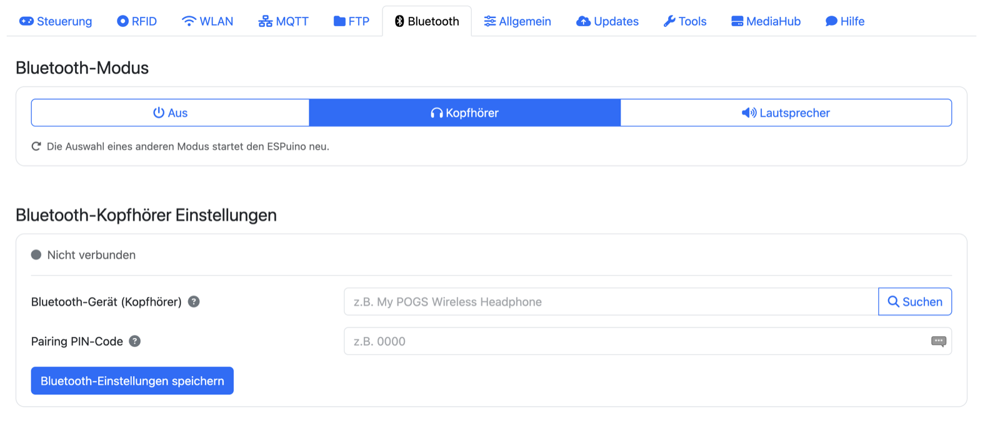

# 8 · The web interface

The web interface is your ESPuino's control center. Practically everything that can be configured
gets configured here – from card assignments through Wi-Fi to firmware updates – and it's also
where you control ongoing playback. This chapter walks you through every area once. You don't need
to absorb it all at once; think of it as a reference where you look up exactly the tab you need
right now.

You reach the web interface in your browser – most conveniently via the hostname
(`http://espuino.local` with mDNS active), otherwise via the IP address. How to get there the first
time is described in [chapter 7 · First start](../inbetriebnahme/erststart.md).

## What applies everywhere

A few elements appear on every page, so here they are up front:

- A **heart icon** pulses in the top right – the connection indicator, called the "heartbeat" in
  the forum ([#4583](https://forum.espuino.de/t/heartbeat/4583), German-language). It monitors the
  connection between your **web browser** and **ESPuino**: the open page sends a small request to
  the device every three seconds; if a reply comes back, the heart pulses green, and if it doesn't,
  it turns red. That way you always know whether the page is still in contact with your ESPuino.
- A **question mark** sits next to many input fields. Clicking it opens a short help text – so if
  you're ever unsure what a setting does, the answer is usually just a click away.
- The **stack icon** at the very top right gives you a menu with language selection (German,
  English, French), **dark mode**, **information** (firmware version, memory, battery), the **log**
  (console output right in your browser), and **restart** and **power off**.
- Saving always happens **per section**, via that section's own button. Its label tells you exactly
  what gets saved.

## Control tab

The Control tab is the remote control in your browser. Here you see – as long as the title or web
stream provides one – the cover art and info for what's currently playing, and operate playback
with the familiar transport buttons (first title, previous, play/pause, next, last). The **volume
slider** takes effect immediately, and the equalizer icon opens three sliders for bass, mid, and
treble.

Two small things are especially handy: the **progress bar** is clickable – clicking it jumps
straight to that point in the title. And **run a modification** triggers any modification (sleep
timer, repeat, button lock, …) directly, without placing a card at all.

## RFID tab { #tab-rfid }

This tab is the heart of the interface, since this is where you link cards to content. It consists
of two areas stacked on top of each other: the file browser and the actual assignment.

### The file browser { #dateibrowser }

The file browser shows the contents of the SD card. The **search field** lets you filter, **upload**
brings individual files or entire directories (including subfolders) onto the ESPuino, and a
**right-click** (on a phone: long-press) on an entry opens a context menu for creating, playing,
refreshing, renaming, deleting, and downloading. For audio files it also offers **Use as battery
warning** – the shortcut to the [low-battery announcement](#akku-ansage).

### Assigning a card

In the section below, you assign content to a card, in four steps:

1. **RFID chip number:** if you place a card, its number is filled in automatically. You can also
   enter it by hand or use a
   [virtual card](https://forum.espuino.de/t/virtual-rfid-cards) (German-language forum).
2. In the **Music** tab, pick a file or folder in the file browser and set the **playback mode**
   (see the table). Choosing *web radio* conveniently pre-fills the path field with `http://`.
3. In the **Modification** tab, you assign an action to the card instead.
4. **Save** – done.

#### Playback modes { #abspielmodi }

The following table lists the modes in the order they appear in the dropdown. The technical IDs
are in the [appendix](../referenz/anhang.md#playmodi).

| Mode | Meaning |
| --- | --- |
| 🎵 Single title | Exactly one file, once. |
| 🎵🔁 Single title (loop) | Repeat one file indefinitely. |
| 🎲💤 Random title from a folder, then sleep | A random title, then deep sleep – the ideal bedtime card. |
| 📖 Audiobook | Titles from a folder, sorted – or just a single file; **the last position is remembered**. |
| 📚 Audiobook, recursive | Like audiobook, including subfolders; position is remembered. |
| 📖🔁 Audiobook (loop) | Audiobook, starts over from the beginning after the last title. |
| 📁 All titles (sorted) | Folder in sorted order, **without** position memory. |
| 🌳 All titles + subfolders (recursive, sorted) | As above, including subfolders, without position memory. |
| 📁🔀 All titles (shuffled) | Folder in random order. |
| 🌳🔀 All titles + subfolders (recursive, shuffled) | Shuffled across folder and subfolders. |
| 📁🔁 All titles (sorted, loop) | Sorted, endless. |
| 📁🔀🔁 All titles (shuffled, loop) | Shuffled, endless. |
| 🎲📁 Random subfolder (sorted) | A random subfolder, sorted. |
| 🎲📁🔀 Random subfolder (shuffled) | A random subfolder, shuffled. |
| 📻 Web radio | A stream URL instead of a file. |
| 📃 List (.m3u) | The entries of a local `.m3u` – files and web streams mixed. |
| 🌐 MediaHub | Content **and** playback mode come from the selected [MediaHub server](../inhalte/mediahub.md). |

#### Modification cards – all options { #modifikationskarten-alle-optionen }

Instead of music, a card can be assigned an action. You'll find the same catalog, incidentally, in
the Control tab under "run a modification", where you trigger the action directly without a card.
The technical IDs are in the [appendix](../referenz/anhang.md#modifikationskarten).

**Locking & sleeping**

| Action | Effect |
| --- | --- |
| 🔒 Button lock | Locks the buttons and rotary encoder on the device, so accidental presses don't trigger anything. |
| 💤 Sleep now | Puts ESPuino into deep sleep immediately. |
| 💤 Sleep after 15 min / 30 min / 1 h / 2 h | Starts a sleep timer; ESPuino shuts down after the chosen time. |
| 💤 Sleep at end of title | ESPuino falls asleep once the current title finishes. |
| 💤 Sleep at end of playlist | ESPuino falls asleep once the current playlist has finished. |
| 💤 Sleep after five titles | ESPuino falls asleep once five more titles have played. |

*For all sleep modes, ESPuino dims the LEDs – so you can tell at a glance that a sleep timer is
active. Strictly speaking they switch on **night mode**, which optionally limits the volume as well –
see [General tab](#wiedergabe).*

**Repeat**

| Action | Effect |
| --- | --- |
| 🔁 Repeat playlist | Repeats the entire playlist endlessly. |
| 🔂 Repeat title | Repeats the current title endlessly. |

**Light, radio & services**

| Action | Effect |
| --- | --- |
| 🌙 Dim LEDs (night mode) | Dims the Neopixels permanently – pleasant, say, in a darkened child's room. Optionally, night mode also limits the volume (see [General tab](#wiedergabe)). |
| 📶 Wi-Fi on/off | Turns Wi-Fi on or off (off saves power and allows purely offline operation). |
| 💡 Ambient light | Toggles a permanent mood-lighting effect for the LEDs. |
| 🔆 / 🔅 LED brightness up / down | Changes the Neopixel brightness by one step. |
| 📁 Enable FTP | Starts the FTP service (until the next restart). |
| 🔊 BT speaker | Switches ESPuino into **Bluetooth speaker mode** (BT sink): it receives audio from a paired device, e.g. your phone, and plays it. |
| 🎧 BT headphones | Switches ESPuino into **Bluetooth headphone mode** (BT source): it sends its audio to paired Bluetooth headphones or a speaker. |
| 🔀 Switch mode | Cycles through the operating modes in order (normal ↔ Bluetooth). |

*The three Bluetooth actions are only available with firmware built with Bluetooth support.*

!!! warning "You can lock yourself out with "Wi-Fi on/off""
    Turning off Wi-Fi also takes the **web interface** with it – and that's exactly where you'd
    normally turn it back on. The only way back is then via the same route you used to turn it off:
    the **modification card** (or a button combination or button you assigned this action to). So
    keep that card somewhere safe before you turn off Wi-Fi.

**Announcements**

| Action | Effect |
| --- | --- |
| 🌐 Announce IP address | Announces the current IP address via speech – handy for finding out the address for the web interface. |
| 🕒 Announce time | Announces the current time. |

**Playback control as a card**

| Action | Effect |
| --- | --- |
| ⏯ Play/Pause | Pauses playback or resumes it. |
| ⏮ / ⏭ Previous / next title | Jumps to the previous or next title. |
| ⏪ / ⏩ First / last title | Jumps to the first or last title of the playlist. |
| 📁 Next / previous folder | Jumps a folder forward or backward (recursive modes only). |
| » / « Seek forward / backward | Seeks a few seconds forward or backward. |
| 🔊 / 🔉 Volume up / down | Changes the volume by one step. |

**Virtual cards & other**

| Action | Effect |
| --- | --- |
| 🏷 Virtual card 01–10 | Refers to one of ten **virtual cards** – assignments that can be triggered without a physical card (say, via a button combination or MQTT). |
| 🗑 Delete assignment | If you assign *this* action to a card, the next time it's placed, that card's existing assignment is removed. |

## Wi-Fi tab { #tab-wlan }

Here you manage everything related to the network connection. Under **Wi-Fi settings**, you decide
whether ESPuino picks the **strongest** of several known networks on startup, what the **hostname**
is, and – for the setup case – what the **access point** is called, whether it has a password, and
when it closes automatically. Under **networks**, you store your Wi-Fi networks; several can be
saved, which is handy if ESPuino occasionally travels along to the grandparents'. Optionally, you
can set a **static IP** per network. Finally, **saved networks** lists every stored Wi-Fi network;
the one currently connected is highlighted, and the trash icon deletes entries.

!!! warning "Access point timeout: please don't leave it at 0"
    Some background: ESPuino only opens the setup access point if it couldn't log into any known
    Wi-Fi network – it's a stopgap for initial setup. This AP is unprotected by default, and as long
    as it's open, **anyone** can connect to it and do whatever they like in the web interface. If
    it's only open briefly, that's acceptable. A timeout of **0**, though, means ESPuino **never**
    closes the AP on its own – giving you a permanent security hole. So don't leave the value at 0
    (or at least set an AP password).

!!! warning "Use a static IP with care"
    Only set a **static IP** if you know what you're doing. If the configuration doesn't match your
    network, ESPuino may become unreachable.

## MQTT tab { #tab-mqtt }

*MQTT support is compiled in by default, so this tab is normally present – it's only missing if
the firmware was deliberately built without MQTT.*

Here you connect ESPuino to your MQTT broker, say for [Home Assistant](https://www.home-assistant.io/),
[ioBroker](https://www.iobroker.net/), or [openHAB](https://www.openhab.org/). You enable MQTT and
enter a client ID, an optional base topic, the device ID, the server, optionally a username and
password, and the port. In the client ID and device ID, you can use the placeholder `<MAC>` – it's
automatically replaced with the MAC address, which is invaluable when running several ESPuinos.
Conveniently, below the fields you see a **live preview of the topics** that result from your
entries. Which topics exist is listed in the [appendix](../referenz/anhang.md#mqtt-topics).

!!! warning "Restart required"
    Changes to the MQTT settings only take effect after a restart – the interface offers one right
    after saving.

## FTP tab { #tab-ftp }

*FTP support is compiled in by default, so this tab is normally present – it's only missing if the
firmware was deliberately built without FTP.*

Here you set the username and password for FTP access. For memory reasons, the FTP server doesn't
run all the time: you start it when needed via the **start FTP server** button (or at the device
via a button combination), and after the next restart it's off again.

!!! tip "For large amounts of data"
    For large amounts of data, the **web upload is now the better choice** – it's been optimized
    and is nowadays faster than FTP (which hardly anyone uses anymore).

## Bluetooth tab

*Only visible if the firmware was built with Bluetooth support.*

ESPuino handles Bluetooth in both directions: it can **send** its audio to a pair of headphones, and
it can conversely become the speaker itself, which you **stream to** from your phone. You control
both in this tab, through a single mode switch at the top.

### Switching the mode

The three buttons **Off**, **Headphones** and **Speaker** sit side by side; the filled one shows
which mode ESPuino is currently in. "Off" isn't a Bluetooth state of its own here – it's simply
normal operation from the SD card.

Clicking another mode **restarts ESPuino** – the note below the buttons says so too. There's no way
around it: the chosen mode is stored permanently and only evaluated at boot. After switching, it
takes a few seconds until the web interface is reachable again – and ESPuino will come up in that
same mode the next time you switch it on, until you change it back.

### Headphone mode: ESPuino sends

Only in this mode does the tab show the settings below the switch at all – in normal operation and in
speaker mode they'd have nothing to do, so they stay hidden.

At the top sits the **connection indicator**: a colored dot, and next to it either "Not connected" or
"Connected to: …" along with the device name. It is queried from ESPuino directly when the page
loads, rather than inferred from events the browser happened to witness. So a freshly loaded web
interface shows the right state even when the connection was established long before you opened the
page.

Below that you enter your **headphones' name**. The **Search** button right next to it is more
convenient: ESPuino then scans its surroundings for a good 13 seconds and lists whatever announces
itself; clicking the right entry puts that device into the name field. The search only works in
headphone mode – try it in another one and a message tells you so. If your headphones need a **PIN
code**, enter it in the field below. And then don't forget to **save**.

Once a device is stored, ESPuino connects to it on its own at startup. If you pick one from the
results list, it retries **up to three times** at one-and-a-half-second intervals before giving up –
Bluetooth headphones tend to answer only on the second attempt after waking up.

!!! tip "You still control the volume on ESPuino"
    The rotary encoder, the buttons and the web interface all work in headphone mode too: ESPuino
    passes the set volume on to the headphones over Bluetooth. The audio itself, on the other hand,
    goes out unprocessed – the equalizer and the mono switch apply only to the built-in speaker.

### Speaker mode: ESPuino receives

There's nothing to configure here. ESPuino announces itself as a Bluetooth speaker, and you pair it
from your phone or tablet as usual; whatever plays there then comes out of its speaker.

Note, though, that the web interface **cannot control playback** in this mode – the source is the
phone, not the SD card. If you try anyway, ESPuino offers in a dialog to switch back to normal mode.

### Back to normal mode

There are three ways. The obvious one is the **Off** button in this tab. An **unknown RFID card**
works just as well: place a card ESPuino doesn't know while in either Bluetooth mode and it returns
to normal mode. That's the escape hatch for when you have no web interface at hand. In **speaker
mode**, an ordinary music card does it too: it ends Bluetooth operation and starts its content.
Headphone mode deliberately behaves differently – there a known card simply plays through the
headphones, which is exactly what that mode is for.

!!! warning "Bluetooth needs memory"
    The Bluetooth stack claims a sizeable share of the internal RAM – and on the ESP32 that, not the
    PSRAM, is the genuinely scarce resource. ESPuino therefore moves out what can be moved out: the
    256 KB buffer for headphone mode, for instance, is allocated on demand and in PSRAM. It can
    still get tight, and tight means: connections fail to come up, or ESPuino restarts out of the
    blue. Bluetooth and Wi-Fi run **in parallel** on top of that – convenient, but it doesn't ease
    the situation, and it is barely tested. More on that in
    [chapter 9 → Operating modes](am-geraet.md#betriebsmodi).

## General tab { #tab-allgemein }

The general settings are visually split into five sub-groups (playback, RFID reader, rotary
encoder & buttons, LED, power). Each has its own save and reset button, but don't let that fool
you: all five belong to **one** shared form. Clicking save therefore stores **all** general
settings at once – not just the sub-group currently visible. So you don't need to save each
sub-group separately.

### Playback { #wiedergabe }

Here you set the basic playback behavior. Under **volume**, you set the startup volume and the
maximum values separately for speaker and headphones, plus a minimum volume so the box can never be
muted entirely. Under **playlist**, you choose the sort mode and the maximum recursion depth.

A word about **position memory** up front, since several of the options depend on it: ESPuino only
remembers the last-heard position in **audiobook mode**, and by default only at the natural points
– when **pausing** and when **changing titles**. The two "remember…" options below extend this with
additional save points.

The **options** section is a collection of behavior toggles – each also has a help text behind its
question mark:

| Option | Effect |
| --- | --- |
| Remember position on power-off | Additionally saves the audiobook position when powering off. |
| Remember position on card change | Additionally saves the position when switching to a different card. |
| Resume last card after restart | Automatically resumes the last-played card after a restart. |
| Pause when card is removed | Pauses when the card is taken off the reader (RC522 and PN5180 – see warning below). |
| Don't re-accept the same card | Ignores placing the same card again; optionally pause↔play instead of restarting. |
| Pause at minimum volume | Pauses once the volume reaches the minimum. |
| Limit volume in night mode | Caps the volume while night mode is active – explained in full right below this table. |
| Restore last volume | Restores the last-used volume after a restart. |
| Mono playback | For builds with only one speaker. |
| Finer steps at low volume | Switches to logarithmic volume calculation – helps if the steps feel too coarse at the low end of the volume range. |

The option **"Limit volume in night mode"** deserves an explanation of its own. It's meant for the
case where the player is taken to bed and the speaker ends up right at someone's ear. When you switch
night mode on, ESPuino remembers the volume set at **that very moment** and makes it a temporary
upper limit – plus one step of headroom, so a slightly too quiet audiobook can still be nudged up a
little. Beyond that it won't go, no matter whether you use the rotary encoder, the buttons, the web
interface, MQTT or Bluetooth. Leave night mode again and the limit is lifted immediately.

The advantage over a fixed maximum comes down to audiobooks differing so much in loudness: a fixed
value would have to be set so low that it would constantly get in the way with quiet recordings. A
limit that moves along adapts by itself to whatever is playing.

!!! info "When night mode is active"
    Not just via the 🌙 modification card or a button assigned to it: **every sleep timer** switches
    it on as well, as does the
    [🎲💤 Random title from a folder, then sleep](#abspielmodi) play mode. So the limit also applies
    when you place "sleep after 30 min", for instance. The option takes effect the **next** time
    night mode is switched on – one already running keeps the limit it started with.

There's also the option **"Automatically save playback position of long audiobooks every _n_
seconds"**, which has ESPuino save the position in audiobook mode **periodically** – meant for long
chapters (files of 5 minutes or more), so a sudden power loss doesn't cost an entire hour of
progress. It's off by default; 30–60 seconds is recommended.

!!! warning "Periodic saving wears on flash memory"
    Every save writes to flash memory, and flash wears out a small amount with every write. So
    don't pick an unnecessarily short interval, and only use this feature where it's really
    worthwhile (long audiobooks). For short titles that already save at every title boundary
    anyway, it doesn't gain you anything.

!!! warning "The "pause when card is removed" option can cause trouble"
    It's popular (card sits there, taking it off pauses), but tricky: if the card briefly goes
    undetected in the meantime, playback pauses unintentionally – one of the most common causes of
    sporadic dropouts. If this happens unreliably for you, reduce the card-to-reader distance,
    increase the PN5180's debounce setting if you're using one, or turn the option off. (The option
    itself works with both RC522 and PN5180; only the debounce setting is specific to the PN5180.)

### RFID reader

This sub-group is about the card reader:

| Setting | Meaning |
| --- | --- |
| **PN5180 LPCD** | Wake from deep sleep by placing a card. Only with the PN5180 and matching solder bridges set – on the Complete, you need to adjust solder bridges **JP1/JP8** for this ([chapter 5](../hardware/aufbau.md#die-lotbrucken)); with the MFRC522, this option is grayed out. Limitations: [chapter 12](../vertiefung/erweiterte-themen.md#lpcd). |
| **Reader type** | *Auto-detect* (default), MFRC522 (SPI or I²C), or PN5180. |
| **MFRC522 gain** | Sensitivity of the MFRC522 (0–7, default 7). |
| **MFRC522 scan interval** | Time between two MFRC522 polls, in milliseconds (default 100 ms). |
| **PN5180 debounce** | How long a card must go continuously *undetected* before it's considered removed (default 500 ms). |
| **ICODE-SLIX2 privacy password** | Four-byte password (hexadecimal values 00–FF only) to disable privacy mode on protected ICODE-SLIX2 tags. |

!!! warning "Restart required"
    Changes in this sub-group only take effect after a restart.

### Rotary encoder & buttons { #drehencoder-taster }

Here you set what the controls do. Important to understand: everything you set here goes into
internal memory (NVS) and **overrides the default mapping baked into the firmware** – so you can
adjust the entire mapping without rebuilding the firmware.

For the **rotary knob** itself, there's **reverse rotation direction**, in case turning right makes
things quieter instead of louder for you – plus the seek step sizes further below. Below that, a
table lets you assign an action for short and long press to each of the six **buttons** (Btn0–Btn5);
`--` means "no action". In addition, actions can be assigned to **simultaneously pressed pairs of
buttons** (all 15 combinations from 0+1 to 4+5, one action each) – handy for rarely used functions
like restart or starting FTP, without sacrificing a dedicated button for them.

!!! tip "Less is often more"
    Technically you can assign a lot here – but hardly anyone will remember a dozen combinations.
    Better to stick to one or two that are genuinely useful. Also keep in mind: children in
    particular sometimes happily mash all the buttons at once and trigger actions you weren't
    expecting – or have long since forgotten about. A clear, simple mapping saves you guesswork
    later.

!!! danger "Lockout trap: "disable Wi-Fi" on a button"
    One of the selectable actions turns **Wi-Fi off**. If you assign it to a button or button
    combination and it gets triggered (possibly by accident), you lock yourself out of the web
    interface – no Wi-Fi means no web interface, and no web interface means no way left to turn
    Wi-Fi back on. The only way out then is to **erase the flash**, which overwrites the NVS, and
    **all settings are gone**. That's exactly why the Wi-Fi-toggle combination is disabled by
    default. If you want Wi-Fi to be toggleable at all, better put that on a **modification card**
    instead – just don't misplace it. 😄

The available actions largely match the modification-card catalog – the two lists differ only at the
edges. **Buttons only**: reset to initial volume, show battery voltage, stop, restart, and a debug
display of task load. The other way round, **cards only**: clearing an assignment. Everything else –
including volume up/down and sleep after five titles – can go on either a button or a card. The
default mapping ESPuino ships with is listed in
[chapter 9 → Buttons](am-geraet.md#tasten-und-tastenkombinationen).

#### Seek step sizes { #sprungweiten }

How far ESPuino seeks depends on *what* you use to seek – so there are two separate blocks for this
on this page.

**Seeking with the buttons** concerns the buttons you've assigned the "seek forward" or "seek
backward" action to. Here you set how many seconds a single button press jumps (1–120, default
**30**).

**Seeking with the rotary encoder** concerns the "hold button + turn" gesture. There are two
mutually exclusive variants for this – which one applies is decided in the rotation-action table
further up, by assigning the gesture either "position preview" or "seek forward"/"seek backward":

| Variant | Settings | Default |
| --- | --- | --- |
| **Position preview** (the more comfortable one) | *Delay before committing* – how long ESPuino waits after the last turn before it jumps. *Number of detents for 0 to 100%* – how many detents span the entire title. | 2000 ms 40 |
| **Direct seeking** (active by default) | *Step size per detent* – how many seconds each individual detent jumps immediately. | 10 s (1–60) |

How the two variants differ in practice is covered in
[chapter 9](am-geraet.md#tasten-und-tastenkombinationen). All values take effect **immediately after
saving** – no restart is needed for this.

### LED

Here you configure the Neopixels. **Brightness** can be set separately for normal operation, night
mode, and ambient light. Under **LED settings** come the details:

| Setting | Meaning |
| --- | --- |
| Number of display LEDs | How many LEDs show status and progress. |
| Number of control LEDs | Additional LEDs, each with a freely chosen color. |
| Idle dots | Number of dots in the idle animation. |
| Progress color gradient | Hue for the start and end of the progress display. |
| Ambient light | Hue and saturation of the ambient light. |
| Dimmable steps | Granularity of the brightness steps. |
| Start LED offset | From which physical LED the display starts (see tip). |
| Pause centering | Centers the pause display. |
| Rotation direction | Reverses the direction of the effects. |
| Briefly flash all LEDs when a tag is recognized | Acknowledges an accepted tag with a brief green flash – see below. |

That last option deserves an extra sentence, because it deliberately leaves out two cases. With it
on, the ring briefly flashes green for every **accepted** tag – visible confirmation that previously
only modification cards gave. An **unknown** tag is still acknowledged in red, so together the two
give an unambiguous answer to every tag you place. A tag refused by "Don't re-accept the same tag",
on the other hand, triggers nothing – nothing happened, after all.

!!! info "No flickering with a tag left in place"
    If you use "Pause when RFID tag is removed" and leave the tag on the reader permanently, poor RF
    conditions can make it get re-detected now and then. That's why the flash isn't tied to the
    reader detecting a tag but to a tag actually being accepted – such hiccups stay invisible.

!!! tip "Positioning the first pixel"
    If the ring sits "rotated" in the enclosure, the **start LED offset** lets you set which
    physical LED the display starts from – so you can align the ring's zero point with how it's
    mounted, without resoldering anything
    ([forum #4670](https://forum.espuino.de/t/neopixel-erstes-pixel-positionieren-geht-das/4670),
    German-language).

A changed LED **count**, by the way, is applied by ESPuino via an automatic restart.

### Power

Under **deep sleep**, you set after how many minutes of inactivity ESPuino goes to sleep. If
battery measurement is active, these values appear under **battery**:

| Setting | Meaning |
| --- | --- |
| Warning voltage | Below this voltage, the Neopixel warns of a low battery. |
| Voltage for 0% / 100% | Sets the bounds of the charge-level display (depends on battery type). |
| Critical shutdown voltage | Optional: ESPuino automatically shuts down below this. |
| Correction value | Fine correction of the measured voltage (± in hundredths of a volt). If the display deviates from a multimeter reading, enter the difference here. Details in [chapter 5 · Fine-tuning](../hardware/aufbau.md#nach-dem-zusammenbau-die-feinjustierung). |
| Measurement interval | How often the battery voltage is measured. |

#### Low-battery announcement { #akku-ansage }

The Neopixel ring does warn about an empty battery, but that only helps if someone is looking – and
in the middle of an audio play nobody is, children least of all. So ESPuino can **speak** the warning
as well: it briefly interrupts playback, plays an audio file of your choosing, and afterwards carries
on at exactly the point it left off.

The feature is **off** by default. To switch it on, tick **Announce a low battery**
here and enter the path to the audio file below it. The [file browser](#dateibrowser) is more
convenient: right-click the file, then **Use as battery warning** – that enters the path, ticks the
box and takes you straight here.

Ready-made announcements in German, English and French live in the firmware repository under
`announcements/`; you simply upload them to the SD card. The two commands used to produce them are
documented there as well – so if you don't like the synthetic voice, you can just as easily record
the announcement yourself.

**Announce only once** determines how persistent the warning is. Without that option it comes with
**every** measurement for as long as the battery stays below the warning threshold – that is, at the
rate of the measurement interval. With it, the warning comes once and then only again after the
voltage has risen back above the threshold and dropped below it again. There is deliberately no
"once per charge" option: ESPuino cannot tell whether it is being charged at all – a voltage that
rises again may just as well be a battery recovering under a lighter load.

!!! info "From the outside, the interruption stays invisible"
    While the announcement plays, title, position and progress stay frozen, and the playlist, track
    number and play mode are never touched in the first place. So neither the web interface nor MQTT
    ever notices that something else was playing in between.

!!! warning "Only while something is playing"
    The announcement only happens when something is actually playing. If ESPuino sits unused on a
    shelf or is paused, nothing happens – there would be no point to return to either. And if the
    given file is missing, playback carries on undisturbed; all that happens is an entry in the
    error log.

With **web radio** the return works too, just differently: a live stream has no position, so ESPuino
reconnects after the announcement. That takes a brief moment – how brief depends on the station.

## Updates tab { #tab-updates }

Here you'll find everything related to firmware updates. You can either upload a `firmware.bin`
manually, or – much more conveniently – fetch a ready-made build directly from the repository via
**load firmware from GitHub**. This is described in full detail in
[chapter 13 · Updating the firmware](../firmware/aktualisieren.md). The GitHub section only appears
with OTA-capable firmware.

## Tools tab

This tab is about the stored RFID assignments, which – worth a reminder – don't live on the SD card
but in internal memory (NVS). You can view all **assignments** (and delete individual ones
directly), **export** them as `backup.txt` and **import** them again (import only adds and
overwrites, never deletes), or use the red button to **delete all assignments** (with a
confirmation prompt). How to use these functions for backing up and transferring data is covered in
[chapter 10 → Backup & restore](../inhalte/verwalten.md#backup-restore-deine-kartenzuordnungen-sichern).

## MediaHub tab { #tab-mediahub }

This tab is purely for **managing server addresses** – the actual card assignment still happens in
the [RFID tab](#tab-rfid). Without a running MediaHub server, this page doesn't do anything; what
MediaHub is and how to set up the server is covered in
[chapter 11 · MediaHub](../inhalte/mediahub.md).

Under **add media server**, you give it a freely chosen **display name** (this later shows up in
the dropdown when teaching a card) and the **address** – protocol (`http://` or `https://`) via
dropdown, followed by host or IP plus port, e.g. `192.168.1.50:8080`. Clicking **"save media
server"** adds it to the **registered media servers** list. From there, you can open it directly in
its own web interface via the icon, or remove it again via the trash icon – cards already taught
are unaffected and keep pointing at the previous server.

## Help tab

The Help tab links to the [forum](https://forum.espuino.de) and to the REST API documentation
(Swagger) – the latter for anyone who wants to script ESPuino or integrate it into their home
automation.
