# 8 · Das Webinterface

Das Webinterface ist die Schaltzentrale deines ESPuino. Praktisch alles, was sich einstellen lässt,
stellst du hier ein – von den Kartenzuweisungen über das WLAN bis zum Firmware-Update –, und ebenso
steuerst du hier die laufende Wiedergabe. Dieses Kapitel führt dich einmal durch alle Bereiche. Du
musst nicht alles auf einmal verstehen; sieh es als Nachschlagewerk, in dem du gezielt den Tab
findest, den du gerade brauchst.

Erreichbar ist das Webinterface im Browser – am bequemsten über den Hostnamen (`http://espuino.local`
bei aktivem mDNS), sonst über die IP-Adresse. Wie du das erste Mal dorthin kommst, ist in
[Kapitel 7 · Erststart](../inbetriebnahme/erststart.md) beschrieben.

## Was überall gilt

Ein paar Elemente begegnen dir auf jeder Seite, deshalb vorab:

- Oben rechts pulsiert ein **Herz-Symbol** – die Verbindungsanzeige, im Forum „Heartbeat" genannt
  ([#4583](https://forum.espuino.de/t/heartbeat/4583)). Es überwacht die Verbindung zwischen deinem
  **Webbrowser** und dem **ESPuino**: Die geöffnete Seite schickt alle drei Sekunden eine kleine
  Anfrage an das Gerät; kommt eine Antwort zurück, pulsiert das Herz grün, bleibt sie aus, wird es
  rot. So siehst du jederzeit, ob die Seite noch mit deinem ESPuino in Kontakt steht.
- Neben vielen Eingabefeldern sitzt ein **Fragezeichen**. Ein Klick darauf öffnet einen kurzen
  Hilfetext – wenn du also mal nicht weißt, was eine Einstellung bewirkt, ist die Antwort meist nur
  einen Klick entfernt.
- Über das **Stapel-Symbol** ganz oben rechts erreichst du ein Menü mit Sprachauswahl (Deutsch,
  Englisch, Französisch), dem **Dunkelmodus**, den **Informationen** (Firmware-Stand, Speicher,
  Batterie), dem **Log** (die Konsolenausgabe direkt im Browser) sowie **Neustart** und
  **Ausschalten**.
- Gespeichert wird immer **pro Bereich**, über den jeweiligen Button. Die Beschriftung sagt dir dabei
  genau, was gespeichert wird.

## Tab Steuerung

Der Tab Steuerung ist die Fernbedienung im Browser. Hier siehst du – sofern der Titel oder Webstream
eines mitliefert – das Cover und die Infos zum laufenden Titel und bedienst die Wiedergabe mit den
gewohnten Transport-Tasten (erster Titel, voriger, Play/Pause, nächster, letzter). Der **Lautstärke-Slider** wirkt sofort, und über das
Equalizer-Symbol öffnest du drei Regler für Bass, Mitten und Höhen.

Zwei Kleinigkeiten sind besonders nützlich: Der **Fortschrittsbalken** ist anklickbar – ein Klick
springt direkt an die gewählte Stelle im Titel. Und über **Modifikation ausführen** löst du jede
Modifikation (Schlaftimer, Wiederholung, Tastensperre …) direkt aus, ganz ohne eine Karte aufzulegen.

## Tab RFID { #tab-rfid }

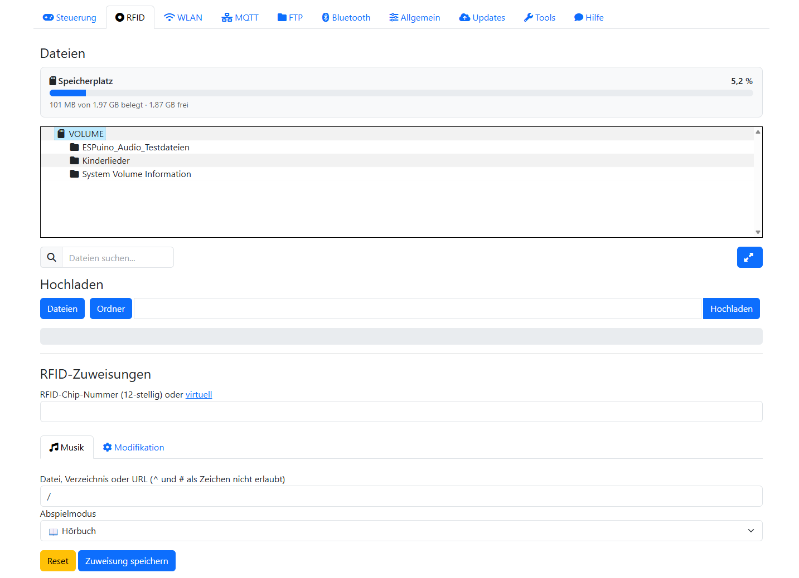

Dieser Tab ist das Herzstück, denn hier verknüpfst du Karten mit Inhalten. Er besteht aus zwei
untereinander angeordneten Bereichen: dem Dateibrowser und der eigentlichen Zuweisung.

### Der Dateibrowser { #dateibrowser }

Der Dateibrowser zeigt den Inhalt der SD-Karte. Über das **Suchfeld** filterst du, per **Upload**
bringst du
einzelne Dateien oder ganze Verzeichnisse (samt Unterordnern) auf den ESPuino, und ein **Rechtsklick**
(am Handy: langes Antippen) auf einen Eintrag öffnet ein Kontextmenü zum Anlegen, Abspielen,
Aktualisieren, Umbenennen, Löschen und Herunterladen. Bei Audiodateien steht dort außerdem **Als
Akku-Warnung festlegen** – die Abkürzung zur [Ansage bei niedrigem Akku](#akku-ansage).

### Eine Karte zuweisen

Im Bereich darunter weist du einer Karte einen Inhalt zu, in vier Schritten:

1. **RFID-Chip-Nummer:** Legst du eine Karte auf, wird die Nummer automatisch eingetragen. Du kannst
   sie auch von Hand eingeben oder eine [virtuelle Karte](https://forum.espuino.de/t/virtual-rfid-cards)
   verwenden.
2. Im Reiter **Musik** wählst du im Dateibrowser eine Datei oder einen Ordner und legst den
   **Abspielmodus** fest (siehe Tabelle). Wählst du *Webradio*, wird das Pfad-Feld bequem mit `http://`
   vorbelegt.
3. Im Reiter **Modifikation** weist du der Karte stattdessen eine Aktion zu.
4. **Speichern** – fertig.

#### Die Abspielmodi { #abspielmodi }

Die folgende Tabelle listet die Modi in der Reihenfolge, in der sie im Dropdown erscheinen. Die
technischen IDs dazu stehen im [Anhang](../referenz/anhang.md#playmodi).

| Modus | Bedeutung |
| --- | --- |
| 🎵 Einzelner Titel | Genau eine Datei, einmal. |
| 🎵🔁 Einzelner Titel (Endlosschleife) | Eine Datei dauerhaft wiederholen. |
| 🎲💤 Zufälliger Titel eines Ordners, danach schlafen | Ein zufälliger Titel, danach Deep Sleep – die ideale Einschlaf-Karte. |
| 📖 Hörbuch | Titel eines Ordners sortiert – oder auch nur eine einzelne Datei; **die letzte Position wird gemerkt**. |
| 📚 Hörbuch rekursiv | Wie Hörbuch, inklusive Unterordner; Position wird gemerkt. |
| 📖🔁 Hörbuch (Endlosschleife) | Hörbuch, beginnt nach dem letzten Titel wieder von vorn. |
| 📁 Alle Titel (sortiert) | Ordner sortiert, **ohne** Positionsspeicherung. |
| 🌳 Alle Titel + Unterordner (rekursiv, sortiert) | Wie oben, inklusive Unterordner, ohne Positionsspeicherung. |
| 📁🔀 Alle Titel (zufällig) | Ordner in zufälliger Reihenfolge. |
| 🌳🔀 Alle Titel + Unterordner (rekursiv, zufällig) | Zufällig über Ordner und Unterordner. |
| 📁🔁 Alle Titel (sortiert, Endlosschleife) | Sortiert, endlos. |
| 📁🔀🔁 Alle Titel (zufällig, Endlosschleife) | Zufällig, endlos. |
| 🎲📁 Zufälliger Unterordner (sortiert) | Ein zufälliger Unterordner, sortiert. |
| 🎲📁🔀 Zufälliger Unterordner (zufällig) | Ein zufälliger Unterordner, zufällig. |
| 📻 Webradio | Eine Stream-URL statt einer Datei. |
| 📃 Liste (.m3u) | Die Einträge einer lokalen `.m3u` – Dateien und Webstreams gemischt. |
| 🌐 MediaHub | Inhalt **und** Abspielmodus kommen vom gewählten [MediaHub-Server](../inhalte/mediahub.md). |

#### Modifikationskarten – alle Optionen { #modifikationskarten-alle-optionen }

Statt Musik lässt sich einer Karte eine Aktion zuordnen. Denselben Katalog findest du übrigens im Tab
Steuerung unter „Modifikation ausführen", wo du die Aktion direkt und ohne Karte auslöst. Die
technischen IDs stehen im [Anhang](../referenz/anhang.md#modifikationskarten).

**Sperren & Schlafen**

| Aktion | Wirkung |
| --- | --- |
| 🔒 Tastensperre | Sperrt Tasten und Drehencoder am Gerät, damit versehentliches Drücken nichts auslöst. |
| 💤 Schlafe sofort | Versetzt ESPuino umgehend in den Deep-Sleep. |
| 💤 Schlafen nach 15 min / 30 min / 1 h / 2 h | Startet einen Schlaftimer; nach der gewählten Zeit schaltet ESPuino ab. |
| 💤 Schlafen nach Ende des Titels | ESPuino schläft ein, sobald der laufende Titel zu Ende ist. |
| 💤 Schlafen nach Ende der Playlist | ESPuino schläft ein, wenn die aktuelle Playlist durchgelaufen ist. |
| 💤 Schlafen nach fünf Titeln | ESPuino schläft ein, sobald fünf weitere Titel gespielt wurden. |

*Bei allen Schlaf-Modi dimmt ESPuino die LEDs – so erkennst du auf einen Blick, dass ein Schlaftimer
aktiv ist. Genau genommen schalten sie den **Nachtmodus** ein, der auf Wunsch zusätzlich die
Lautstärke begrenzt – siehe [Tab Allgemein](#wiedergabe).*

**Wiederholung**

| Aktion | Wirkung |
| --- | --- |
| 🔁 Playlist endlos | Wiederholt die gesamte Playlist endlos. |
| 🔂 Titel endlos | Wiederholt den aktuellen Titel endlos. |

**Licht, Funk & Dienste**

| Aktion | Wirkung |
| --- | --- |
| 🌙 LEDs dimmen (Nachtmodus) | Dimmt die Neopixel dauerhaft – angenehm etwa im abgedunkelten Kinderzimmer. Optional begrenzt der Nachtmodus zusätzlich die Lautstärke (siehe [Tab Allgemein](#wiedergabe)). |
| 📶 WLAN an/aus | Schaltet das WLAN ein oder aus (aus spart Strom und erlaubt reinen Offline-Betrieb). |
| 💡 Ambient Light | Schaltet eine dauerhafte Stimmungsbeleuchtung der LEDs um. |
| 🔆 / 🔅 LED-Helligkeit heller / dunkler | Ändert die Helligkeit der Neopixel um eine Stufe. |
| 📁 FTP aktivieren | Startet den FTP-Dienst (bis zum nächsten Neustart). |
| 🔊 BT-Lautsprecher | Schaltet ESPuino in den **Bluetooth-Lautsprecher-Modus** (BT-Senke): Er empfängt Audio von einem gekoppelten Gerät, z. B. dem Handy, und gibt es aus. |
| 🎧 BT-Kopfhörer | Schaltet ESPuino in den **Bluetooth-Kopfhörer-Modus** (BT-Quelle): Er sendet seinen Ton an einen gekoppelten Bluetooth-Kopfhörer oder -Lautsprecher. |
| 🔀 Modus wechseln | Schaltet der Reihe nach durch die Betriebsmodi (Normal ↔ Bluetooth). |

*Die drei Bluetooth-Aktionen sind nur bei einer Firmware mit Bluetooth-Unterstützung verfügbar.*

!!! warning "Mit „WLAN an/aus" kannst du dich aussperren"
    Schaltest du das WLAN ab, ist damit auch das **Webinterface weg** – und genau dort würdest du es
    normalerweise wieder einschalten. Zurück kommst du dann nur über denselben Weg, über den du es
    ausgeschaltet hast: die **Modifikationskarte** (bzw. eine Tastenkombination oder einen Taster, dem
    du diese Aktion zugewiesen hast). Bewahre die Karte also gut auf, bevor du das WLAN abschaltest.

**Ansagen**

| Aktion | Wirkung |
| --- | --- |
| 🌐 IP-Adresse ansagen | Sagt die aktuelle IP-Adresse per Sprachausgabe an – praktisch, um die Adresse fürs Webinterface herauszufinden. |
| 🕒 Uhrzeit ansagen | Sagt die aktuelle Uhrzeit an. |

**Wiedergabesteuerung als Karte**

| Aktion | Wirkung |
| --- | --- |
| ⏯ Play/Pause | Pausiert die Wiedergabe oder setzt sie fort. |
| ⏮ / ⏭ Titel zurück / vor | Springt zum vorherigen bzw. nächsten Titel. |
| ⏪ / ⏩ erster / letzter Titel | Springt zum ersten bzw. letzten Titel der Playlist. |
| 📁 Ordner vor / zurück | Springt einen Ordner vor oder zurück (nur in rekursiven Modi). |
| » / « Sekunden vor / zurück | Spult einige Sekunden vor bzw. zurück. |
| 🔊 / 🔉 Lauter / Leiser | Ändert die Lautstärke um eine Stufe. |

**Virtuelle Karten & Sonstiges**

| Aktion | Wirkung |
| --- | --- |
| 🏷 Virtuelle Karte 01–10 | Verweist auf eine von zehn **virtuellen Karten** – Zuordnungen, die sich ohne physische Karte auslösen lassen (etwa per Tastenkombination oder MQTT). |
| 🗑 Zuordnung löschen | Weist du *diese* Aktion einer Karte zu, wird beim nächsten Auflegen die bestehende Zuordnung dieser Karte entfernt. |

## Tab WLAN { #tab-wlan }

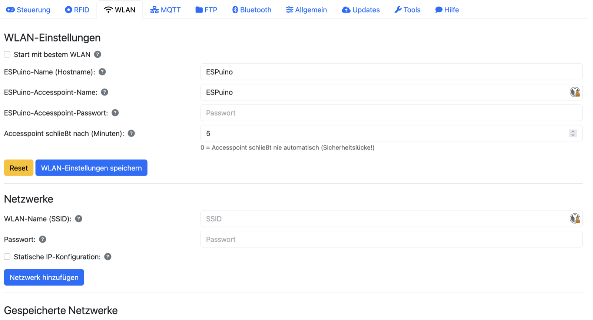

Hier verwaltest du alles rund um die Netzwerkverbindung. Unter **WLAN-Einstellungen** legst du fest,
ob ESPuino beim Start das **stärkste** von mehreren bekannten Netzen wählt, wie der **Hostname**
lautet und – für den Einrichtungsfall – wie der **Access-Point** heißt, ob er ein Passwort hat und
wann er sich automatisch schließt. Unter **Netzwerke** hinterlegst du deine WLANs; es lassen sich
mehrere speichern, was praktisch ist, wenn ESPuino auch mal mit zu den Großeltern reist. Optional
kannst du pro Netzwerk eine **statische IP** setzen. Die **gespeicherten Netzwerke** schließlich
listet alle hinterlegten WLANs auf; das gerade verbundene ist hervorgehoben, und über das
Mülleimer-Symbol löschst du Einträge.

!!! warning "Access-Point-Timeout: bitte nicht auf 0 lassen"
    Kurz zum Hintergrund: Den Einrichtungs-Access-Point spannt ESPuino nur dann auf, wenn er sich in
    kein bekanntes WLAN einloggen konnte – er ist also ein Notnagel für die Ersteinrichtung. Dieser
    AP ist standardmäßig ungeschützt, und solange er offen ist, kann sich **jeder** damit verbinden
    und im Webinterface beliebige Dinge anstellen. Ist er nur kurz offen, ist das vertretbar. Ein
    Timeout von **0** bedeutet aber, dass ESPuino den AP **nie** von selbst schließt – und damit hast
    du ein dauerhaftes Sicherheitsproblem. Lass den Wert deshalb nicht auf 0 stehen (oder vergib
    zumindest ein AP-Passwort).

!!! warning "Statische IP nur mit Bedacht"
    Eine **statische IP** solltest du nur setzen, wenn du weißt, was du tust. Passt die Konfiguration
    nicht zu deinem Netz, ist ESPuino unter Umständen nicht mehr erreichbar.

## Tab MQTT { #tab-mqtt }

*MQTT-Unterstützung ist standardmäßig einkompiliert, dieser Tab also normalerweise vorhanden – er
fehlt nur, wenn die Firmware bewusst ohne MQTT gebaut wurde.*

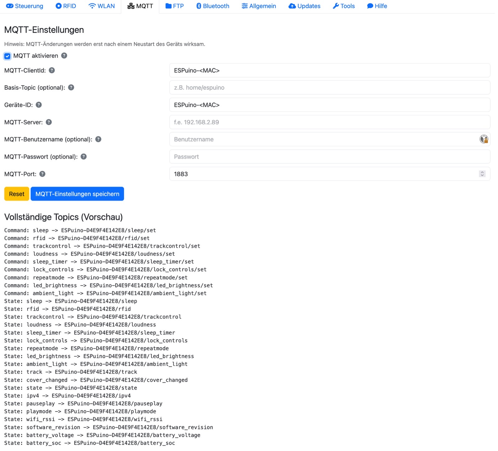

Hier bindest du ESPuino an deinen MQTT-Broker an, etwa für [Home Assistant](https://www.home-assistant.io/),
[ioBroker](https://www.iobroker.net/) oder [openHAB](https://www.openhab.org/). Du
aktivierst MQTT und trägst ClientId, ein optionales Basis-Topic, die Geräte-ID, den Server, optional
Benutzername und Passwort sowie den Port ein. In ClientId und Geräte-ID darfst du den Platzhalter
`<MAC>` verwenden – er wird automatisch durch die MAC-Adresse ersetzt, was bei mehreren ESPuinos
Gold wert ist. Praktischerweise siehst du unterhalb der Felder eine **Live-Vorschau der Topics**, die
sich aus deinen Eingaben ergeben. Welche Topics es gibt, steht im
[Anhang](../referenz/anhang.md#mqtt-topics).

!!! warning "Neustart nötig"
    Änderungen an den MQTT-Einstellungen greifen erst nach einem Neustart – das Interface bietet ihn
    nach dem Speichern gleich an.

## Tab FTP { #tab-ftp }

*FTP-Unterstützung ist standardmäßig einkompiliert, dieser Tab also normalerweise vorhanden – er
fehlt nur, wenn die Firmware bewusst ohne FTP gebaut wurde.*

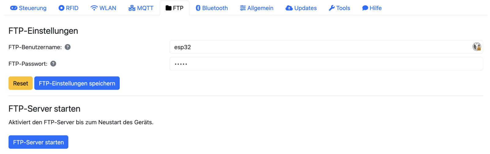

Hier legst du Benutzernamen und Passwort für den FTP-Zugang fest. Aus Speichergründen läuft der
FTP-Server nicht dauerhaft mit: Du startest ihn bei Bedarf über den Button **FTP-Server starten**
(oder am Gerät über eine Tastenkombination), und nach dem nächsten Neustart
ist er wieder aus.

!!! tip "Für große Datenmengen"
    Für große Mengen ist inzwischen der **Web-Upload die bessere Wahl** – er wurde optimiert und ist
    heute schneller als FTP (das kaum noch jemand nutzt).

## Tab Bluetooth

*Nur sichtbar, wenn die Firmware mit Bluetooth-Unterstützung gebaut wurde.*

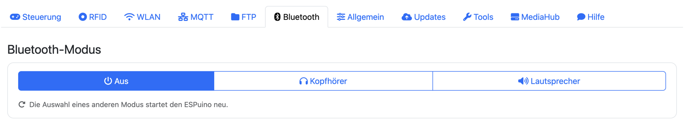

ESPuino beherrscht Bluetooth in beide Richtungen: Er kann seinen Ton an einen Kopfhörer **senden**,
und er kann umgekehrt selbst zum Lautsprecher werden, auf den du vom Handy **streamst**. Beides
steuerst du in diesem Tab über einen gemeinsamen Umschalter ganz oben.

### Den Modus umschalten

Die drei Schaltflächen **Aus**, **Kopfhörer** und **Lautsprecher** liegen nebeneinander; die
ausgefüllte zeigt, in welchem Modus ESPuino gerade läuft. „Aus" ist dabei kein eigener
Bluetooth-Zustand, sondern schlicht der normale Betrieb mit der SD-Karte.

Ein Klick auf einen anderen Modus **startet den ESPuino neu** – der Hinweis unter den Schaltflächen
sagt das auch. Das lässt sich nicht umgehen: Der gewünschte Modus wird dauerhaft gespeichert und erst
beim Hochfahren ausgewertet. Nach dem Umschalten dauert es also ein paar Sekunden, bis das
Webinterface wieder erreichbar ist – und ESPuino startet auch beim nächsten Einschalten wieder in
diesem Modus, solange du ihn nicht zurückstellst.

### Kopfhörer-Modus: ESPuino sendet

Nur in diesem Modus blendet der Tab die Einstellungen unterhalb des Umschalters überhaupt ein – im
Normalbetrieb und im Lautsprecher-Modus hätten sie nichts zu tun und bleiben deshalb verborgen.

Ganz oben steht die **Verbindungsanzeige**: ein farbiger Punkt und daneben entweder „Nicht verbunden"
oder „Verbunden mit: …" samt Gerätenamen. Sie wird beim Öffnen der Seite direkt beim ESPuino
abgefragt und nicht aus zufällig mitgehörten Ereignissen abgeleitet. Ein frisch geladenes
Webinterface zeigt also auch dann den richtigen Stand, wenn die Verbindung längst vor dem Öffnen der
Seite zustande gekommen ist.

Darunter trägst du den **Namen deines Kopfhörers** ein. Bequemer ist der Knopf **Suchen** direkt
daneben: ESPuino durchsucht dann gut 13 Sekunden lang die Umgebung und listet auf, was sich meldet;
ein Klick auf den passenden Eintrag übernimmt das Gerät ins Namensfeld. Die Suche funktioniert
ausschließlich im Kopfhörer-Modus – versuchst du es in einem anderen, weist dich eine Meldung darauf
hin. Verlangt dein Kopfhörer einen **PIN-Code**, trägst du ihn in das Feld darunter ein. Und dann
nicht vergessen: **speichern**.

Ist ein Gerät hinterlegt, verbindet sich ESPuino beim Start von allein damit. Wählst du eines aus der
Trefferliste, versucht er es bei einem Fehlschlag **bis zu dreimal** im Abstand von anderthalb
Sekunden, bevor er aufgibt – Bluetooth-Kopfhörer melden sich nach dem Aufwachen gerne erst im zweiten
Anlauf.

!!! tip "Die Lautstärke regelst du weiterhin am ESPuino"
    Drehencoder, Taster und Webinterface wirken auch im Kopfhörer-Modus: ESPuino reicht die
    eingestellte Lautstärke über Bluetooth an den Kopfhörer weiter. Der Ton selbst geht dagegen
    unbearbeitet hinaus – Equalizer und Mono-Umschaltung gelten nur für den eingebauten Lautsprecher.

### Lautsprecher-Modus: ESPuino empfängt

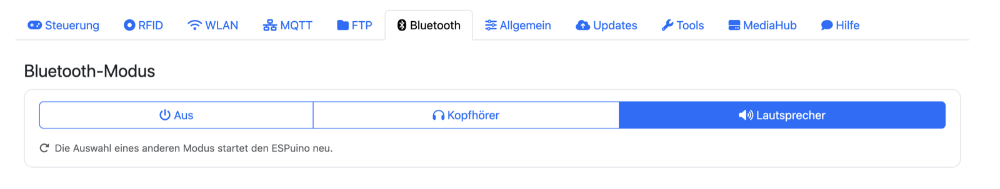

Hier gibt es nichts einzustellen. ESPuino meldet sich als Bluetooth-Lautsprecher, und du koppelst ihn
ganz normal vom Handy oder Tablet aus; alles, was dort läuft, kommt anschließend aus seinem
Lautsprecher.

Beachte aber, dass das Webinterface in diesem Modus **keine Wiedergabe steuern** kann – die Quelle
ist ja das Handy und nicht die SD-Karte. Versuchst du es trotzdem, bietet ESPuino in einem Dialogfeld
an, in den Normalmodus zurückzuwechseln.

### Zurück in den Normalmodus

Dafür gibt es drei Wege. Der naheliegendste ist die Schaltfläche **Aus** in diesem Tab. Genauso
funktioniert eine **unbekannte RFID-Karte**: Legst du in einem der beiden Bluetooth-Modi eine Karte
auf, die ESPuino nicht kennt, kehrt er in den Normalmodus zurück. Das ist der Rettungsweg für den
Fall, dass du gerade kein Webinterface zur Hand hast. Im **Lautsprecher-Modus** genügt darüber hinaus
eine ganz normale Musikkarte: Sie beendet den Bluetooth-Betrieb und startet ihren Inhalt. Im
Kopfhörer-Modus ist das bewusst anders – dort spielt eine bekannte Karte einfach über den Kopfhörer,
denn genau dafür ist dieser Modus ja da.

!!! warning "Bluetooth braucht Speicher"
    Der Bluetooth-Stack belegt einen erheblichen Teil des internen Arbeitsspeichers – und der ist
    beim ESP32 die wirklich knappe Ressource, der PSRAM hilft dort nur begrenzt weiter. ESPuino
    lagert deshalb aus, was sich auslagern lässt: Der 256 KB große Puffer für den Kopfhörer-Modus
    etwa wird erst bei Bedarf und dann im PSRAM angelegt. Eng werden kann es trotzdem, und eng heißt
    hier: Verbindungen kommen nicht zustande, oder ESPuino startet unvermittelt neu. Bluetooth und
    WLAN laufen dabei **parallel** – das ist bequem, entspannt die Lage aber nicht und ist wenig
    getestet. Mehr dazu in [Kapitel 9 → Betriebsmodi](am-geraet.md#betriebsmodi).

## Tab Allgemein { #tab-allgemein }

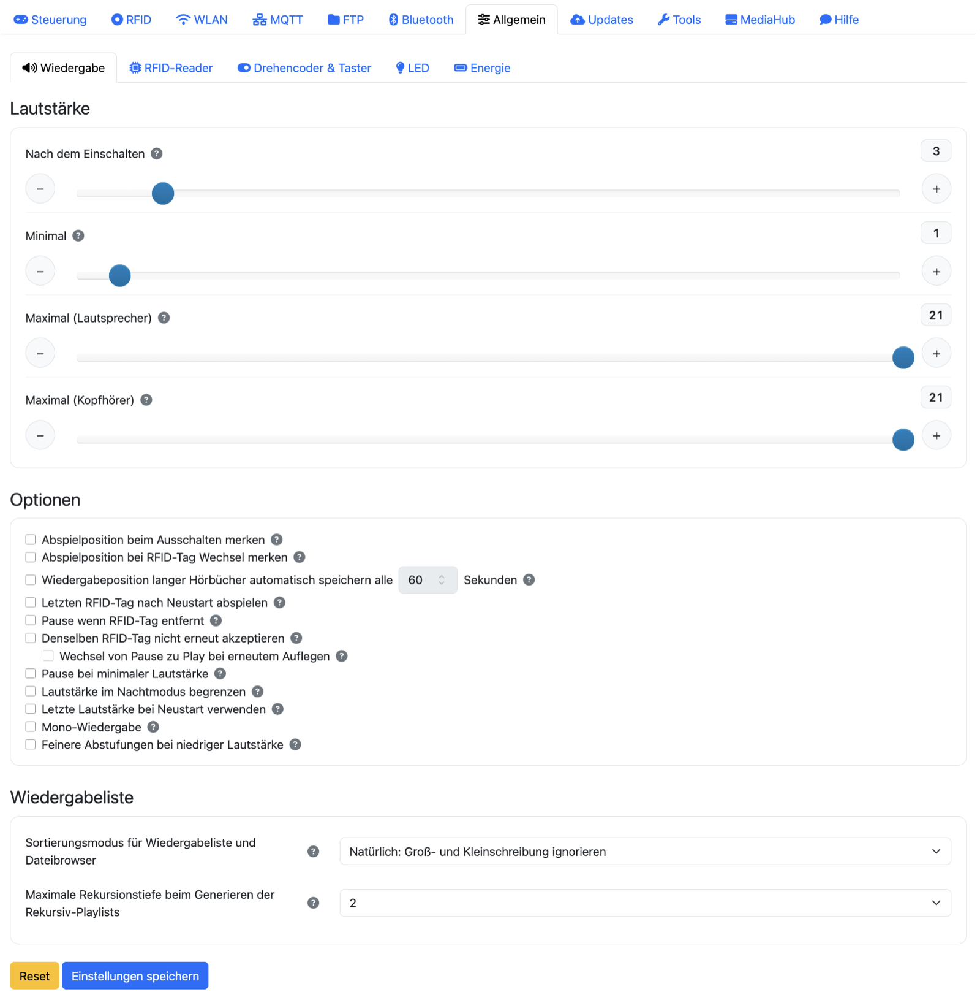

Die allgemeinen Einstellungen sind optisch in fünf Unterkladden aufgeteilt (Wiedergabe, RFID-Reader,
Drehencoder & Taster, LED, Energie). Jede hat zwar ihren eigenen Speichern- und Reset-Button, aber
lass dich davon nicht täuschen: Alle fünf gehören zu **einem** gemeinsamen Formular. Ein Klick auf
Speichern sichert deshalb **alle** allgemeinen Einstellungen auf einmal – nicht nur die gerade
sichtbare Unterkladde. Du musst also nicht in jeder Unterkladde einzeln speichern.

### Wiedergabe { #wiedergabe }

Hier stellst du das grundlegende Abspielverhalten ein. Unter **Lautstärke** legst du die
Startlautstärke und die Maximalwerte getrennt für Lautsprecher und Kopfhörer fest, dazu eine
Minimal-Lautstärke, damit sich die Box nie ganz stummschalten lässt. Unter **Wiedergabeliste** wählst
du den Sortiermodus und die maximale Rekursionstiefe.

Ein Wort zur **Positionsspeicherung** vorab, weil mehrere der Optionen daran hängen: ESPuino merkt
sich die zuletzt gehörte Stelle **nur im Hörbuch-Modus**, und standardmäßig nur an den natürlichen
Punkten – beim **Pausieren** und beim **Titelwechsel**. Die beiden folgenden „…merken"-Optionen
erweitern das um zusätzliche Speicherzeitpunkte.

Der Bereich **Optionen** ist eine Sammlung von Verhaltensschaltern – zu jedem gibt es zusätzlich einen
Hilfetext am Fragezeichen:

| Option | Wirkung |
| --- | --- |
| Position beim Ausschalten merken | Sichert die Hörbuch-Position **zusätzlich** beim Ausschalten. |
| Position bei Kartenwechsel merken | Sichert die Position **zusätzlich** beim Wechsel auf eine andere Karte. |
| Letzte Karte nach Neustart abspielen | Setzt nach einem Neustart automatisch die zuletzt gespielte Karte fort. |
| Pause bei entfernter Karte | Pausiert, wenn die Karte vom Leser genommen wird (RC522 und PN5180 – siehe Warnung unten). |
| Gleiche Karte nicht erneut akzeptieren | Ignoriert erneutes Auflegen derselben Karte; optional Pause↔Play statt Neustart. |
| Pause bei minimaler Lautstärke | Pausiert, sobald die Lautstärke das Minimum erreicht. |
| Lautstärke im Nachtmodus begrenzen | Deckelt die Lautstärke, solange der Nachtmodus aktiv ist – ausführlich erklärt direkt unter dieser Tabelle. |
| Letzte Lautstärke wiederherstellen | Stellt nach einem Neustart die zuletzt genutzte Lautstärke wieder her. |
| Mono-Wiedergabe | Für Aufbauten mit nur einem Lautsprecher. |
| Feinere Abstufungen bei niedriger Lautstärke | Schaltet auf logarithmische Lautstärkeberechnung um – hilft, wenn dir die Stufen im unteren Lautstärkebereich zu grob sind. |

Eine eigene Erklärung verdient die Option **„Lautstärke im Nachtmodus begrenzen"**. Sie ist für den
Fall gedacht, dass die Box mit ins Bett genommen wird und der Lautsprecher dann direkt am Ohr liegt.
Schaltest du den Nachtmodus ein, merkt sich ESPuino die Lautstärke, die **in genau diesem Moment**
eingestellt ist, und macht sie zur vorübergehenden Obergrenze – eine Stufe Spielraum gibt es
zusätzlich, damit ein etwas zu leises Hörbuch noch ein wenig lauter gedreht werden kann. Darüber
hinaus geht es dann nicht mehr, egal ob über Drehencoder, Taster, Webinterface, MQTT oder Bluetooth.
Verlässt du den Nachtmodus wieder, ist die Begrenzung sofort aufgehoben.

Der Vorteil gegenüber einem fest eingestellten Maximalwert liegt darin, dass Hörbücher
unterschiedlich laut sind: Ein fester Wert müsste so niedrig gewählt werden, dass er bei leisen
Aufnahmen ständig im Weg wäre. Die mitwandernde Grenze passt sich dagegen von selbst an das an, was
gerade läuft.

!!! info "Wann der Nachtmodus aktiv ist"
    Nicht nur über die Modifikationskarte 🌙 oder eine entsprechend belegte Taste: Auch **jeder
    Schlaftimer** schaltet ihn mit ein, ebenso der Abspielmodus
    [🎲💤 Zufälliger Titel eines Ordners, danach schlafen](#abspielmodi). Die Begrenzung greift also
    beispielsweise auch, wenn du „Schlafen nach 30 min" auflegst. Die Option wirkt jeweils ab dem
    **nächsten** Einschalten des Nachtmodus – ein bereits laufender behält die Grenze, mit der er
    gestartet ist.

Zusätzlich gibt es die Option **„Wiedergabeposition langer Hörbücher automatisch speichern alle _n_
Sekunden"**, mit der ESPuino die Position im Hörbuch-Modus **zyklisch** sichert – gedacht für lange
Kapitel (Dateien ab 5 Minuten), damit ein plötzlicher Stromausfall nicht den Fortschritt einer ganzen
Stunde kostet. Standardmäßig ist die Option aus; empfohlen werden 30–60 Sekunden.

!!! warning "Zyklisches Speichern belastet den Flash-Speicher"
    Jedes Speichern schreibt in den Flash-Speicher, und der nutzt sich mit jedem Schreibvorgang ein
    kleines Stück ab. Wähle das Intervall deshalb nicht unnötig kurz und setze die Funktion nur dort
    ein, wo sie wirklich lohnt (lange Hörbücher). Bei kurzen Titeln, die ohnehin an jeder Titelgrenze
    speichern, bringt sie nichts.

!!! warning "Die Option „Pause bei entfernter Karte" kann Ärger machen"
    Sie ist beliebt (Karte liegt auf, Abnehmen pausiert), aber heikel: Wird die Karte zwischendurch
    kurz nicht erkannt, pausiert die Wiedergabe ungewollt – einer der häufigsten Gründe für sporadische
    Aussetzer. Läuft es bei dir unzuverlässig, verkleinere den Abstand Karte↔Leser, erhöhe – falls du
    einen PN5180 nutzt – dessen Debounce, oder schalte die Option ab. (Die Option selbst funktioniert
    mit RC522 und PN5180; nur die Debounce-Einstellung ist dem PN5180 vorbehalten.)

### RFID-Reader

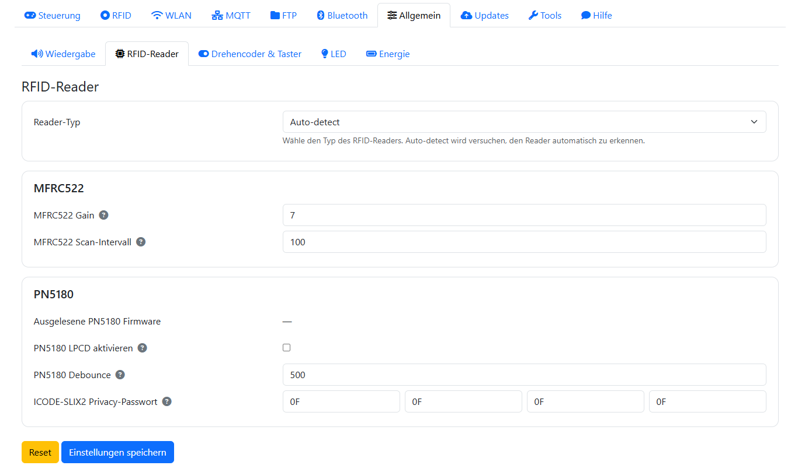

In dieser Unterkladde geht es um den Kartenleser:

| Einstellung | Bedeutung |
| --- | --- |
| **PN5180 LPCD** | Aufwecken aus dem Deep-Sleep durch Kartenauflegen. Nur mit PN5180 und passend gesetzten Lötbrücken – bei der Complete musst du dafür die Lötbrücken **JP1/JP8** anpassen ([Kapitel 5](../hardware/aufbau.md#die-lotbrucken)); bei MFRC522 ist die Option ausgegraut. Einschränkungen: [Kapitel 12](../vertiefung/erweiterte-themen.md#lpcd). |
| **Reader-Typ** | *Auto-detect* (Standard), MFRC522 (SPI oder I²C) oder PN5180. |
| **MFRC522 Gain** | Empfindlichkeit des MFRC522 (0–7, Standard 7). |
| **MFRC522 Scan-Intervall** | Zeit zwischen zwei Abfragen des MFRC522 in Millisekunden (Standard 100 ms). |
| **PN5180 Debounce** | Wie lange eine Karte ununterbrochen *nicht* erkannt sein muss, bevor sie als entfernt gilt (Standard 500 ms). |
| **ICODE-SLIX2 Privacy-Passwort** | Vier-Byte-Passwort (nur Hexadezimalwerte 00–FF) zum Deaktivieren des Privacy-Modus geschützter ICODE-SLIX2-Tags. |

!!! warning "Neustart nötig"
    Änderungen in dieser Unterkladde greifen erst nach einem Neustart.

### Drehencoder & Taster { #drehencoder-taster }

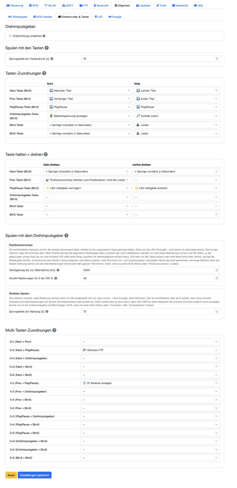

Hier legst du fest, was die Bedienelemente tun. Wichtig zu verstehen: Alles, was du hier einstellst,
landet im internen Speicher (NVS) und **überschreibt die in der Firmware hinterlegte
Standardbelegung** – du kannst die komplette Belegung also anpassen, ohne die Firmware neu zu bauen.

Für den **Drehregler** selbst gibt es die **Drehrichtung umkehren**, falls bei dir Rechtsdrehen leiser
statt lauter macht – dazu weiter unten die Sprungweiten fürs Spulen. Darunter ordnest du in einer Tabelle jedem der sechs
**Taster** (Btn0–Btn5) je eine Aktion für kurzen und langen Druck zu; `--` bedeutet „keine Aktion".
Zusätzlich lassen sich Aktionen auf **gleichzeitig gedrückte Tasterpaare** legen (alle 15
Kombinationen von 0+1 bis 4+5, jeweils eine Aktion) – praktisch für selten gebrauchte Funktionen wie
Neustart oder FTP-Start, ohne dafür einen eigenen Taster zu opfern.

!!! tip "Weniger ist oft mehr"
    Technisch kannst du hier eine Menge belegen – aber ein Dutzend Kombinationen wird sich kaum jemand
    merken. Beschränke dich lieber auf ein, zwei wirklich sinnvolle. Bedenke außerdem: Gerade Kinder
    drücken schon mal munter auf allen Tasten gleichzeitig herum und lösen dabei Aktionen aus, mit
    denen du nicht rechnest – oder die du längst wieder vergessen hast. Eine übersichtliche Belegung
    erspart dir hinterher das Rätselraten.

!!! danger "Aussperr-Falle: „WLAN deaktivieren" auf einer Taste"
    Eine der wählbaren Aktionen schaltet das **WLAN ab**. Legst du sie auf eine Taste oder
    Tastenkombination und löst sie (womöglich versehentlich) aus, sperrst du dich damit aus dem
    Webinterface aus – ohne WLAN keine Weboberfläche, und ohne Weboberfläche auch kein Weg mehr, das
    WLAN wieder einzuschalten. Der einzige Ausweg ist dann, den **Flash zu löschen**; dabei wird das
    NVS überschrieben, und **alle Einstellungen sind weg**. Genau deshalb ist die WLAN-Umschalt-Kombination
    ab Werk deaktiviert. Willst du WLAN überhaupt umschaltbar haben, leg das lieber auf eine
    **Modifikationskarte** – die solltest du dann allerdings nicht verlegen. 😄

Die zur Auswahl stehenden Aktionen entsprechen weitgehend dem Modifikationskarten-Katalog – die
beiden Listen unterscheiden sich nur an den Rändern. **Nur als Taster** gibt es: Initiale Lautstärke,
Batteriespannung anzeigen, Stop, Neustart und eine Debug-Anzeige der Taskauslastung. Umgekehrt gibt es
**nur als Karte** das Löschen einer Zuordnung. Alles andere – auch Lauter/Leiser und das Schlafen nach
fünf Titeln – kannst du wahlweise auf eine Taste oder auf eine Karte legen. Die Standardbelegung, mit
der ESPuino ausgeliefert wird, findest du in
[Kapitel 9 → Tasten](am-geraet.md#tasten-und-tastenkombinationen).

#### Sprungweiten beim Spulen { #sprungweiten }

Wie weit ESPuino beim Spulen springt, hängt davon ab, *womit* du spulst – deshalb gibt es dafür zwei
getrennte Blöcke auf dieser Seite.

**Spulen mit den Tasten** betrifft die Taster, denen du die Aktion „Vorspulen" oder „Zurückspulen"
zugewiesen hast. Hier legst du fest, um wie viele Sekunden ein einzelner Tastendruck springt
(1–120, Standard **30**).

**Spulen mit dem Drehimpulsgeber** betrifft die „Taste halten + drehen"-Geste. Dafür gibt es zwei
Varianten, die sich gegenseitig ausschließen – welche greift, entscheidest du in der Dreh-Aktions-Tabelle
weiter oben, indem du der Geste entweder „Positionsvorschau" oder „Vorspulen"/„Zurückspulen" zuweist:

| Variante | Einstellungen | Standard |
| --- | --- | --- |
| **Positionsvorschau** (die komfortablere) | *Verzögerung bis zur Übernahme* – wie lange ESPuino nach der letzten Drehung wartet, bevor er springt. *Anzahl Rasterungen für 0 bis 100 %* – wie viele Rasterungen einmal über den ganzen Titel führen. | 2000 ms 40 |
| **Direktes Spulen** (ab Werk aktiv) | *Sprungweite pro Rastung* – um wie viele Sekunden jede einzelne Rasterung sofort springt. | 10 s (1–60) |

Wie sich die beiden Varianten im Betrieb unterscheiden, steht in
[Kapitel 9](am-geraet.md#tasten-und-tastenkombinationen). Alle Werte wirken **sofort nach dem
Speichern**, ein Neustart ist dafür nicht nötig.

### LED

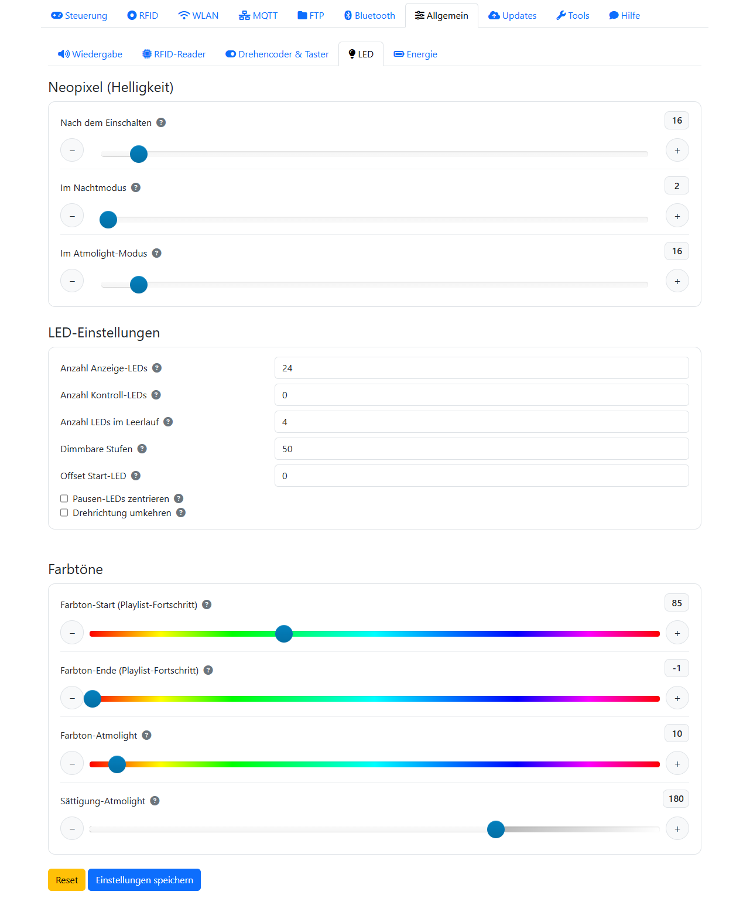

Hier stellst du die Neopixel ein. Die **Helligkeit** lässt sich getrennt für den Normalbetrieb, den
Nachtmodus und das Ambient-Light festlegen. Unter **LED-Einstellungen** kommen die Details dazu:

| Einstellung | Bedeutung |
| --- | --- |
| Anzahl Anzeige-LEDs | Wie viele LEDs Status und Fortschritt anzeigen. |
| Anzahl Kontroll-LEDs | Zusätzliche LEDs, jede mit frei wählbarer Farbe. |
| Punkte im Leerlauf | Anzahl der Punkte in der Leerlauf-Animation. |
| Fortschritts-Farbverlauf | Farbton für Beginn und Ende der Fortschrittsanzeige. |
| Atmolight | Farbton und Sättigung des Ambient-Lights. |
| Dimmbare Zwischenstufen | Feinheit der Helligkeitsabstufung. |
| Start-LED-Offset | Ab welcher physischen LED die Anzeige beginnt (siehe Tipp). |
| Pause-Zentrierung | Zentriert die Pause-Anzeige. |
| Laufrichtung | Kehrt die Drehrichtung der Effekte um. |
| Kurzes Aufleuchten aller LEDs bei erkannter Karte | Quittiert eine angenommene Karte mit kurzem grünem Aufleuchten – siehe unten. |

Die letzte Option verdient einen Satz mehr, weil sie zwei Fälle bewusst auslässt. Ist sie aktiv,
leuchtet der Ring bei jeder **angenommenen** Karte kurz grün auf – eine sichtbare Bestätigung, die es
vorher nur für Modifikationskarten gab. Eine **unbekannte** Karte wird weiterhin rot quittiert, beides
zusammen ergibt also eine eindeutige Antwort auf jede aufgelegte Karte. Eine Karte, die wegen
„Denselben RFID-Tag nicht erneut akzeptieren" abgelehnt wird, löst dagegen nichts aus – es ist ja
auch nichts passiert.

!!! info "Kein Geflacker bei liegender Karte"
    Wenn du „Pause wenn RFID-Tag entfernt" nutzt und die Karte dauerhaft auf dem Leser liegt, kann
    sie bei ungünstigen Funkverhältnissen zwischendurch neu erkannt werden. Das Aufleuchten hängt
    deshalb nicht an der Erkennung durch den Leser, sondern an der tatsächlich angenommenen Karte –
    solche Aussetzer bleiben dadurch unsichtbar.

!!! tip "Das erste Pixel positionieren"
    Sitzt der Ring im Gehäuse „verdreht", legst du mit dem **Start-LED-Offset** fest, an welcher
    physischen LED die Anzeige beginnt – so richtest du den Nullpunkt des Rings an deiner Einbaulage
    aus, ohne umzulöten ([Forum #4670](https://forum.espuino.de/t/neopixel-erstes-pixel-positionieren-geht-das/4670)).

Eine geänderte LED-**Anzahl** übernimmt ESPuino übrigens per automatischem Neustart.

### Energie

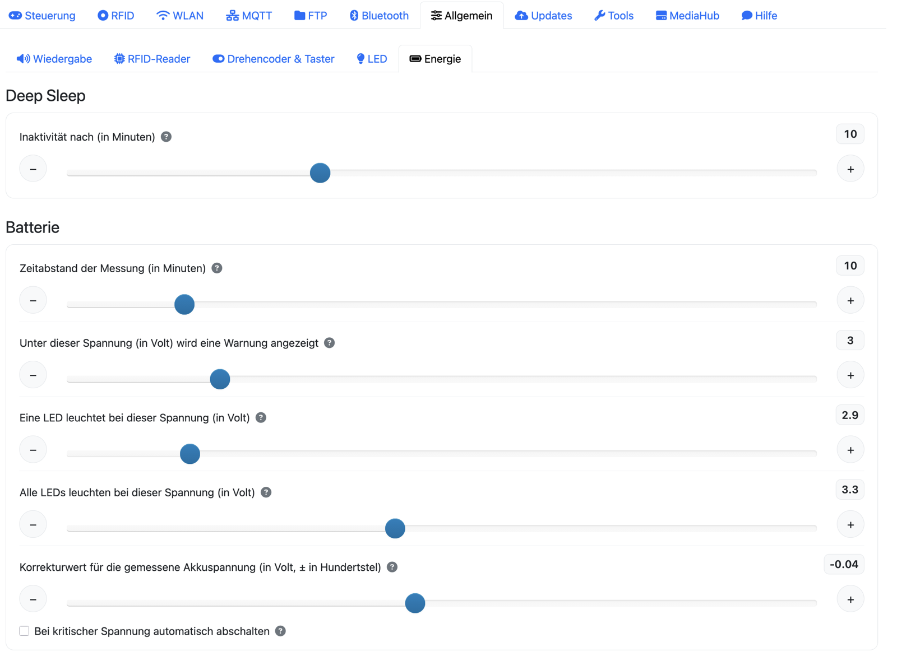

Unter **Deep Sleep** legst du fest, nach wie vielen Minuten Inaktivität sich ESPuino schlafen legt.
Ist die Batteriemessung aktiv, kommen unter **Batterie** diese Werte hinzu:

| Einstellung | Bedeutung |
| --- | --- |
| Warnspannung | Ab dieser Spannung warnt der Neopixel vor niedrigem Akku. |
| Spannung für 0 % / 100 % | Legt die Grenzen der Ladezustands-Anzeige fest (abhängig vom Akkutyp). |
| Kritische Abschaltspannung | Optional: ESPuino schaltet unterhalb automatisch ab. |
| Korrekturwert | Feinkorrektur der gemessenen Spannung (± in Hundertstel-Volt). Weicht die Anzeige von einer Multimeter-Messung ab, trägst du hier die Differenz ein. Details in [Kapitel 5 · Feinjustierung](../hardware/aufbau.md#nach-dem-zusammenbau-die-feinjustierung). |
| Messintervall | Wie oft die Batteriespannung gemessen wird. |

#### Ansage bei niedrigem Akku { #akku-ansage }

Der Neopixelring warnt zwar vor einem leeren Akku, aber das hilft nur, wenn jemand hinsieht – und
mitten im Hörspiel sieht niemand hin, Kinder am allerwenigsten. Deshalb kann ESPuino die Warnung
zusätzlich **ansagen**: Er unterbricht die Wiedergabe kurz, spielt eine Audiodatei deiner Wahl ab und
macht danach genau dort weiter, wo er aufgehört hat.

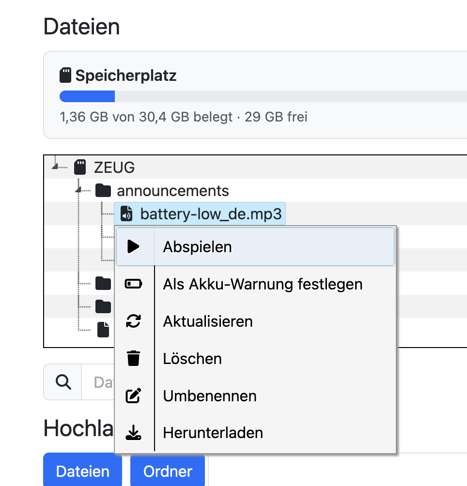

Ab Werk ist die Funktion **deaktiviert**. Zum Einschalten setzt du hier das Häkchen bei **Warnung
bei leerem Akku ansagen** und trägst darunter den Pfad zur Audiodatei ein. Bequemer geht es über den
[Dateibrowser](#dateibrowser): ein Rechtsklick auf die Datei, dann **Als Akku-Warnung festlegen** –
das trägt den Pfad ein, setzt das Häkchen und bringt dich gleich hierher.

Fertige Ansagen in Deutsch, Englisch und Französisch liegen im Firmware-Repository im Ordner
`announcements/`; du lädst sie einfach auf die SD-Karte hoch. Dort ist auch dokumentiert, mit welchen
zwei Befehlen sie erzeugt wurden – wenn dir die synthetische Stimme nicht gefällt, sprichst du die
Ansage also genauso gut selbst ein.

Mit **Nur einmal ansagen** bestimmst du, wie hartnäckig die Warnung ist. Ohne diese Option kommt sie
bei **jeder** Messung, solange der Akku unter der Warnschwelle liegt – also im Takt des
Messintervalls. Mit der Option kommt sie einmal und danach erst wieder, wenn die Spannung
zwischenzeitlich über die Warnschwelle gestiegen und anschließend erneut darunter gefallen ist. Eine
Option „einmal je Ladung“ gibt es bewusst nicht: ESPuino kann gar nicht erkennen, ob geladen wird –
eine Spannung, die wieder steigt, kann genauso gut ein Akku sein, der sich bei geringerer Last erholt.

!!! info "Von außen bleibt die Unterbrechung unsichtbar"
    Während der Ansage bleiben Titel, Position und Fortschritt eingefroren, und Playlist,
    Titelnummer und Abspielmodus werden gar nicht erst angefasst. Weder das Webinterface noch MQTT
    bekommen also mit, dass zwischendurch etwas anderes lief.

!!! warning "Nur bei laufender Wiedergabe"
    Angesagt wird nur, wenn tatsächlich etwas spielt. Steht ESPuino ungenutzt im Regal oder ist er
    pausiert, passiert nichts – dort gäbe es auch keine Stelle, zu der zurückgesprungen werden
    könnte. Und fehlt die angegebene Datei, läuft die Wiedergabe ungestört weiter; es bleibt bei
    einem Eintrag im Fehlerprotokoll.

Bei **Webradio** klappt der Rücksprung ebenfalls, nur anders: Eine Position gibt es bei einem
Livestream nicht, also verbindet sich ESPuino nach der Ansage neu. Das dauert einen kurzen Moment –
wie kurz, hängt vom Sender ab.

## Tab Updates { #tab-updates }

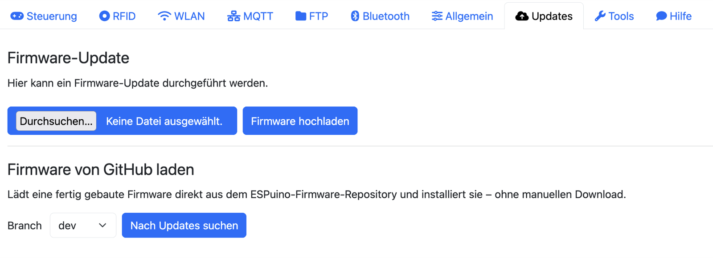

An dieser Stelle findest du alles rund ums Firmware-Update. Du kannst entweder eine `firmware.bin` von
Hand hochladen, oder – deutlich bequemer – über **Firmware von GitHub laden** direkt einen fertigen
Build aus dem Repository holen. Ausführlich ist das in
[Kapitel 13 · Firmware aktualisieren](../firmware/aktualisieren.md) beschrieben. Der GitHub-Bereich
erscheint nur bei OTA-fähiger Firmware.

## Tab Tools

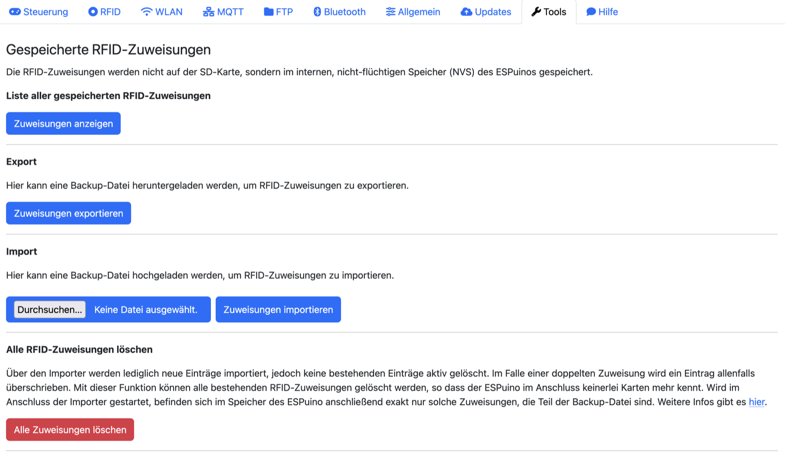

Dieser Tab dreht sich um die gespeicherten RFID-Zuweisungen, die – daran sei erinnert – nicht auf der
SD-Karte liegen, sondern im internen Speicher (NVS). Du kannst dir alle **Zuweisungen anzeigen** (und
einzelne direkt löschen), sie als `backup.txt` **exportieren** und wieder **importieren** (der Import
ergänzt und überschreibt nur, löscht nie), oder mit dem roten Button **alle Zuweisungen löschen** (mit
Sicherheitsabfrage). Wie du diese Funktionen zum Sichern und Übertragen nutzt, steht in
[Kapitel 10 → Backup & Restore](../inhalte/verwalten.md#backup-restore-deine-kartenzuordnungen-sichern).

## Tab MediaHub { #tab-mediahub }

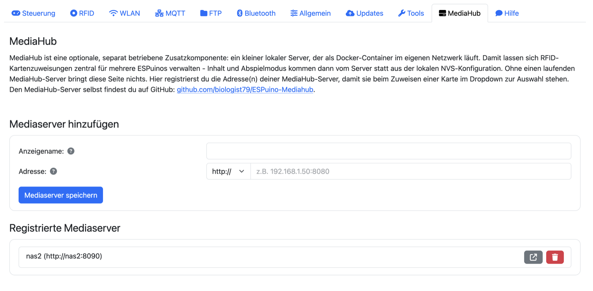

Dieser Tab ist reine **Verwaltung der Server-Adressen** – die eigentliche Kartenzuweisung passiert
weiterhin im [Tab RFID](#tab-rfid). Ohne einen laufenden MediaHub-Server bringt diese Seite nichts;
was MediaHub ist und wie du den Server aufsetzt, steht in
[Kapitel 11 · MediaHub](../inhalte/mediahub.md).

Unter **Mediaserver hinzufügen** vergibst du einen frei wählbaren **Anzeigenamen** (erscheint später
im Auswahl-Dropdown beim Kartenanlernen) sowie die **Adresse** – Protokoll (`http://` oder `https://`)
per Dropdown, dahinter Host oder IP samt Port, etwa `192.168.1.50:8080`. Ein Klick auf
**„Mediaserver speichern"** trägt den Server in die Liste **Registrierte Mediaserver** ein. Dort
kannst du ihn über das Icon direkt in seiner eigenen Weboberfläche öffnen oder über das
Mülleimer-Symbol wieder entfernen – bereits angelernte Karten bleiben davon unberührt, sie verweisen
weiterhin auf den bisherigen Server.

## Tab Hilfe

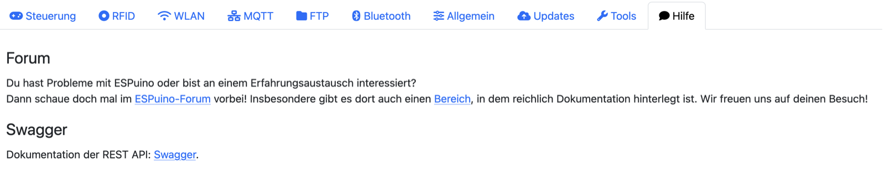

Der Tab Hilfe verweist auf das [Forum](https://forum.espuino.de) und auf die REST-API-Dokumentation
(Swagger) – Letzteres für alle, die ESPuino skripten oder in ihre Hausautomatisierung einbinden wollen.
