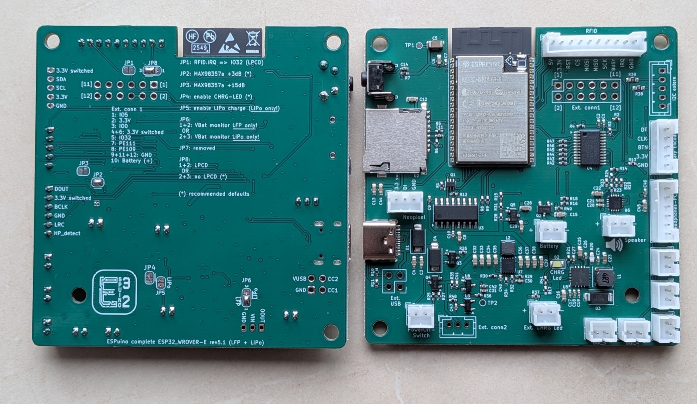
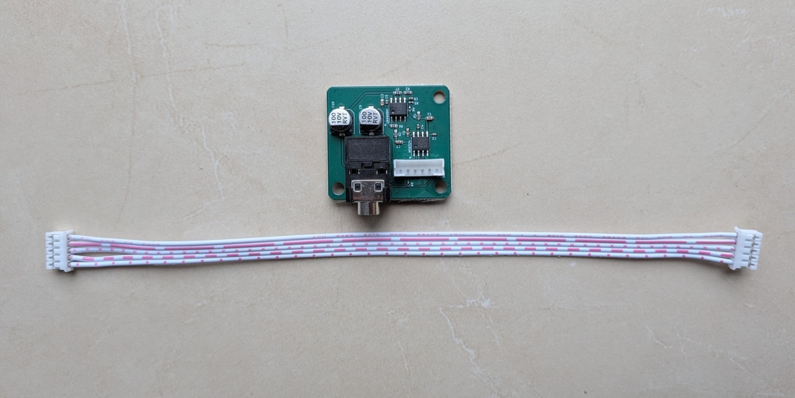

# 5 · Wiring it up

The good news first: assembling the [Complete](complete.md) is manageable. The board arrives
**fully populated** – all the SMD soldering of the tiny components is already done, and the solder
bridges that configure your device are already set at the factory to match your order. What's left
is straightforward: solder a few wires, connect the rotary encoder, and put everything into the
enclosure. No SMD, no special skills required.

For guidance while building, the detailed
[assembly tutorial in the forum (#3863)](https://forum.espuino.de/t/tutorial-aufbau-complete-platine-samt-inbetriebnahme-und-tipps/3863)
(German-language) is a good companion, along with the threads on the
[Complete (#3817)](https://forum.espuino.de/t/espuino-complete/3817) and the
[encoder kit (#2414)](https://forum.espuino.de/t/drehencoder-by-espuino/2414).

!!! danger "Two things can destroy your board – please take these seriously"
    - **Check the battery's polarity.** LFP batteries (including some from Eremit) have, at times,
      shipped with **swapped polarity**. Never blindly assume that plus and minus are where you
      expect them to be – before connecting for the first time, **always** compare the connector
      against the labels printed on the board.
    - **Never rely on wire colors.** Wire colors on connecting cables aren't standardized; what
      counts is always the printed label on the board. This is especially critical for the
      **Neopixel**: swap the polarity here, and you get a short circuit that can, in the worst
      case, destroy the entire board.

## What you get

Already populated are, among other things, the ESP32-WROVER, the amplifier, the charge controller,
the voltage monitoring, the port expander, and the SD slot. A few optional connectors, on the other
hand, are deliberately left unpopulated – most notably the one for **I²C**. Two reasons are behind
that: first, I²C simply isn't needed yet. Second, the I²C connector has the same **five pins** as
the one for the rotary encoder, so the two could easily be confused. Leaving the I²C connector
unpopulated rules that out from the start.

## The solder bridges { #die-lotbrucken }

Several solder bridges (jumpers) on the back set fundamental properties of the board – above all
the battery type, the gain, and the RFID power supply. The good news up front: on your Complete,
they're already set at the **factory to match your order** (typically: JP2 at +3 dB, JP4
automatic, JP5 and JP6 depending on battery type, JP8 at the default). Normally, you don't need to
touch any of this. If you want to change something later – switching battery type, say – here's
what each jumper means. But the most important thing first:

!!! danger "Read first, solder second"
    - **Only set JP5 for LiPo – never for LFP!** JP5 sets the charge cutoff voltage: set = **4.2 V**
      (LiPo), open = **3.6 V** (LFP). If you set JP5 while an **LFP battery** is connected, it will
      be overcharged – **fire risk!**
    - **JP6 must match the battery type.** JP6 selects the undervoltage threshold: **LFP
      (~2.75 V)** or **LiPo (~3.15 V)**. If JP6 is set to **LFP** while a **LiPo** is connected, the
      cutoff only triggers at 2.75 V – the LiPo is then **discharged too deeply** and can be
      damaged. The cutoff must therefore always match the battery chemistry in use.
    - **The undervoltage cutoff (JP6) and the RFID power supply (JP8) must be set** – otherwise the
      Complete, or the card reader, won't work at all.

| Jumper | Function | Positions |
| --- | --- | --- |
| **JP2 / JP3** | Base gain of the audio amplifier | **Never both at once!** JP2 = +3 dB JP3 = +15 dB neither = +9 dB **Set at the factory: JP2 (+3 dB)** – loud enough, and finer volume steps in software. |
| **JP4** | Internal charge LED | Closes the circuit for the **on-board LED** that indicates charging (blinking/on/off – see [chapter 3 → Charging & the charge LED](complete.md#laden-lade-led)). Closed at the factory from rev. 5.1 onward (no soldering needed); before that, activate with 1+2. |
| **JP5** | Charge cutoff voltage | set = 4.2 V (**LiPo**), open = 3.6 V (**LFP**) – ⚠️ see warning above. |
| **JP6** | Undervoltage cutoff | 1+2 = **LFP** (~2.75 V), 2+3 = **LiPo** (~3.15 V). One of the two **must** be set and **must match the battery type** – ⚠️ see warning above. |
| **JP8** | RFID power supply / LPCD | 2+3 = default (recommended), 1+2 = LPCD mode. **Must** be set. |
| **JP1** | LPCD for the PN5180 | 1+2 = LPCD active (IRQ on GPIO 32, then occupies Ext connector 1), open = no LPCD. Only useful together with JP8 (1+2). |

!!! note "Switching battery type later"
    The battery type lives in **JP5** (charge voltage) and **JP6** (undervoltage cutoff) – those
    are the one or two bridges you move to switch between LiPo and LFP afterwards. Remember to
    also adjust the battery voltage thresholds in the web interface afterward (see
    [fine-tuning](#nach-dem-zusammenbau-die-feinjustierung)), so the charge level is signaled
    correctly via the **LED ring**.

## Soldering the wires

Now come the connections you make yourself. They run through JST-PH connectors (2 mm), and – as
noted in the warning above – you **always** go by the **labels printed on the board**, never by
wire color. What needs connecting:

- the **RFID reader**: the RC522 doesn't need all the wires; wrap the unused ones with insulating
  tape to be safe. The PN5180, on the other hand, uses every connection. Which wire goes where is
  covered in the [pinout below](#rfid-steckerbelegung).
- the **speaker** (two-pin).
- the **Neopixel** – whether a ring, a strip, or a single LED – via three wires (GND, 5 V, data).
  On rings, the data line is usually labeled **DI** (Data In) and **DO** (Data Out); you connect to
  **DI**. Once again, polarity matters especially here: **reversed polarity on LEDs is
  particularly risky**, because it behaves like a **short circuit**.
- the **buttons** (each two-pin).
- the **rotary encoder**: goes into the five-pin connector. With the ESPuino encoder kit, it's just
  **plugged in**; with a different encoder, you solder the wires yourself (more on that just
  below).
- optionally the **headphone board**, which you plug into the six-pin connector.

### RFID connector pinout { #rfid-steckerbelegung }

The [Complete](complete.md)'s RFID connector is a **10-pin connector**. The pinout is based on the
PN5180, which uses every line; the RC522 needs fewer. **The firmware detects automatically** which
reader is connected – the pinout is purely a hardware matter. In the table below, "–" marks what
the RC522 doesn't need.

| Connector (Complete) | PN5180 | RC522 | Meaning |
| --- | --- | --- | --- |
| **5 V** | +5 V | – | Only supplies 3.3 V, but still powers the PN5180 |
| **3.3 V** | +3.3 V | 3.3 V | Power supply |
| **RST** | RST | – | Reset (PN5180 only) |
| **CS** | NSS | SDA | SPI: chip/slave select |
| **MOSI** | MOSI | MOSI | SPI: master out, slave in |
| **MISO** | MISO | MISO | SPI: master in, slave out |
| **SCK** | SCK | SCK | SPI: clock |
| **BUSY** | BUSY | – | Busy (PN5180 only) |
| **IRQ** | IRQ | – | Interrupt (PN5180 only) |
| **GND** | GND | GND | Ground |

For the **RC522**, only the SPI lines (CS/MOSI/MISO/SCK) plus **3.3 V** and **GND** are needed;
RST, BUSY, and IRQ are left unconnected (they do nothing there). Source:
[forum → ESPuino Complete (#3817)](https://forum.espuino.de/t/espuino-complete/3817) (German).

## The rotary encoder

The ESPuino board has a **five-pin, reverse-polarity-safe JST-PH connector** for the rotary
encoder. How the encoder gets connected to it depends on what you choose:

- With the **[ESPuino encoder kit](https://forum.espuino.de/t/drehencoder-by-espuino/2414)**,
  **nothing needs soldering as far as the wiring goes**: it comes with a ready-made cable with
  **connectors on both ends** – one side goes into the ESPuino board, the other into the encoder's
  adapter board. Only the kit itself needs soldering, see just below.
- If you use **any other rotary encoder**, you only get a five-pin **JST-PH connecting cable**: its
  connector goes into the ESPuino board, and you **solder the loose wires at the other end
  yourself** onto your encoder.

!!! warning "Own encoder: don't forget the pull-up resistors"
    If you use your own rotary encoder, make sure its board has **pull-up resistors** populated.
    Ready-made encoder modules normally have this, but it's still worth a quick check: if they're
    missing, you get **"ghost touches"** – ESPuino registers rotation that never actually happened.
    The ESPuino encoder kit already has them on board, so you don't need to worry about it there.

The kit consists of:

- the **rotary encoder** itself,
- a small **adapter board** (with three pull-up resistors already populated),
- a five-pin **JST-PH socket**, and
- the matching **connecting cable**.

You do need to solder it together yourself, though: the rotary encoder and the JST socket go onto
the adapter board – on **opposite sides**.

!!! danger "Kit only: solder onto the correct side!"
    The **rotary encoder** is inserted from the side that has the **rectangle printed on it**; the
    **JST socket** goes on the **other side**. To check: the printed marking (the rectangle or
    number) must end up **covered** by the respective component. Solder it the wrong way around,
    and it won't fit together cleanly, and the encoder won't work. The exact pictures for this are
    in the [encoder thread (#2414)](https://forum.espuino.de/t/drehencoder-by-espuino/2414)
    (German).

If it later turns out that "louder" and "quieter" are swapped, that's no reason to re-solder
anything: the rotation direction can be reversed in the web interface
([chapter 8 → Rotary encoder & buttons](../bedienung/webinterface.md#drehencoder-taster)).

Once everything is connected, continue with [fitting it into the enclosure](gehaeuse.md) and the
fine-tuning below.

## After assembly: fine-tuning { #nach-dem-zusammenbau-die-feinjustierung }

Once everything is built, the [first start](../inbetriebnahme/erststart.md) follows. There are a
few settings you should adjust once to match your specific hardware – most conveniently right in
the web interface.

The most important ones are the **battery voltage thresholds**, since they depend on the battery
type. Important to understand: **ESPuino has no way of knowing whether an LFP or a LiPo battery is
connected** – the firmware can't detect that. That's exactly why you need to set the matching
voltage thresholds yourself; otherwise ESPuino might mistake a full LFP battery for half-empty, or
the other way around. **The thresholds for LFP are set by default** – if you use a LiPo, adjust
them accordingly. As a guideline:

| Battery | Warning from | first LED from | all LEDs from |
| --- | --- | --- | --- |
| **LFP** (default) | 3.0 V | 2.9 V | 3.25 V |
| **LiPo** | 3.2 V | 3.1 V | 4.2 V |

The ESP32 measures the battery voltage via its built-in **ADC** (analog-to-digital converter) – the
component that translates an analog voltage into a numeric value the firmware can work with.
However, this ADC is **no precision instrument**: the reading isn't accurate down to the last
millivolt, but in practice it's still **fairly good**.

If the displayed voltage still doesn't match reality – say, a freshly charged battery is reported
as "not quite full" – the measurement can be **calibrated**: compare the ESPuino reading with a
multimeter measurement, and enter the difference as a **correction value** in the web interface's
battery settings. The value takes effect immediately after saving.

!!! info "In the web interface since September 2026"
    This correction value (`offsetVoltage`) can be set **directly in the web interface since
    September 2026**. In older firmware, this was only possible via `offsetVoltage` in
    `settings-complete.h`.

Otherwise, now is the right moment to correct the **Neopixel rotation direction** and the **rotary
encoder direction** if needed, adjust the **button mapping**, and teach the first **RFID cards**.
