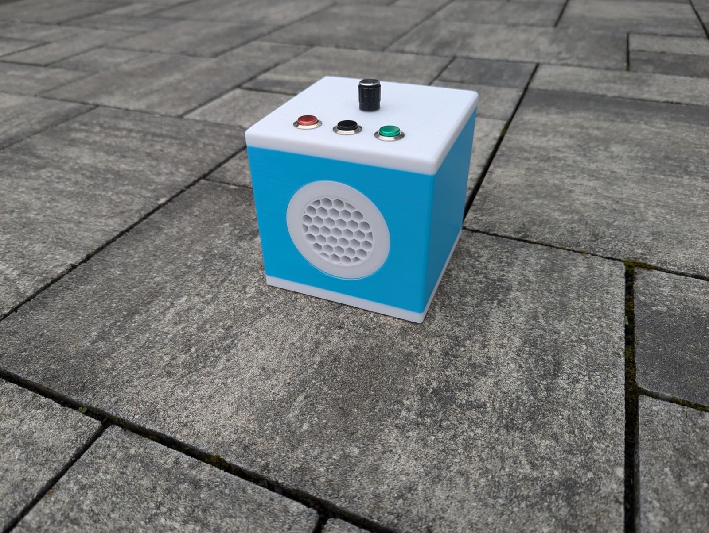

# 6 · Das Gehäuse

Wohin mit der fertig verdrahteten Platine? Die meisten ESPuinos stecken in einem **3D-gedruckten
Gehäuse** – wie groß, wie bunt und in welcher Form, entscheidest du selbst. Dieses Kapitel gibt dir
einen Startpunkt; mehr als ein Referenzdesign und ein paar Hinweise braucht es dafür nicht.

!!! tip "Lass dich in der Galerie inspirieren"
    Wie vielfältig ESPuinos aussehen können – von 3D-Druck über Holz bis zu umgebauten Fundstücken –
    zeigt die Galerie [„Zeigt her eure ESPuinos" (#554)](https://forum.espuino.de/t/zeigt-her-eure-espuinos/554).
    Eine schöne Fundgrube für eigene Gehäuse-Ideen.

## Das Referenz-Design: die BioBox { #referenz-design-biobox }

Als **Referenz-Design** dient die **[BioBox 3D](https://forum.espuino.de/t/biobox-3d/3130)**, ein
3D-druckbares Gehäuse für Complete oder mini4L. Sie gibt eine gute Vorstellung davon, wie ein
fertiger ESPuino aussehen kann: ein Würfel mit rund 12 cm Kantenlänge, vorn ein Wabengitter für den
Lautsprecher mit einer Vertiefung für den Neopixelring, oben drei Tasten und der Drehencoder, hinten
USB-C und Kopfhörerbuchse, unten eine Revisionsöffnung und eine Akkuhalterung (für 18650-, 26650-
oder 32700-Zellen). Die Druckdateien gibt es als STL und als Fusion-360-Datei; empfohlen werden PETG,
fünf Wandschichten und 35 % Infill (etwa 17 Stunden Druckzeit auf einem Bambu Lab P1S).

*Die BioBox 3D – das Referenz-Design für ein 3D-gedrucktes ESPuino-Gehäuse.*

## Es muss kein 3D-Druck sein: Holz & Co

3D-Druck ist der verbreitetste, aber längst nicht der einzige Weg. Manche nehmen ein **fertiges
Holzgehäuse** (etwa eine Holzbox aus dem Bastelbedarf) und arbeiten die nötigen Aussparungen selbst
hinein; andere **bauen ihr Gehäuse komplett aus Holz**. Ein schönes Beispiel ist die
**[BioBox v2 (#1654)](https://forum.espuino.de/t/biobox-v2/1654)** – der hölzerne Vorgänger der
heutigen BioBox 3D.

## Woran du beim Gehäuse denken solltest

Egal ob BioBox oder Eigenentwurf – ein paar Aussparungen, Zugänge und freie Flächen sollte jedes
Gehäuse vorsehen:

- **RFID-Reader** – der braucht als Einziger *keine* Öffnung, sondern eine **freie Fläche**: Er liest
  durch die Gehäusewand hindurch. Sieh also einen Bereich vor, hinter dem der Reader sitzt und auf den
  die Karte gelegt wird – ohne Metall dazwischen und mit einer nicht allzu dicken Wand.
- **Lautsprecher** – ein Gitter oder Löcher vor der Membran, damit nichts eingedrückt werden kann.
- **Neopixel** – eine Öffnung oder ein lichtdurchlässiges Fenster für den Ring. Die nackten LEDs sind
  für sich genommen kein besonders schöner Anblick; ein **Diffusorring** kaschiert sie und lässt das
  Licht zugleich weicher und gleichmäßiger wirken.
- **Tasten und Drehencoder** – Durchbrüche an den passenden Stellen.
- **USB-C** – zum Laden und Flashen gut erreichbar. Bewährt haben sich hier **magnetische
  USB-Stecker**: Der kleine Adapter bleibt dauerhaft in der Buchse, die Leitung hält magnetisch von
  außen. Vor allem kann so nichts unbeabsichtigt abgerissen werden – stolpert jemand über die Leitung
  oder zieht daran, löst sich einfach die Magnetverbindung, statt Buchse oder Platine zu beschädigen.
  Nebenbei trifft man damit die Gehäuseöffnung leichter.
- **Kopfhörerbuchse** – falls du die Kopfhörerplatine verbaust. Anders als bei USB kannst du hier
  **nicht** mit einem dauerhaft steckenden Adapter oder einer Verlängerungsleitung arbeiten: Sobald ein
  Klinkenstecker in der Buchse sitzt, erkennt ESPuino das als „Kopfhörer angeschlossen" und der
  Lautsprecher bleibt stumm. Die Buchse selbst muss also von außen erreichbar sein. Damit die kleine
  Platine im Gehäuse nicht lose herumliegt, gibt es einen **3D-druckbaren Träger** dafür:
  [Träger für die Kopfhörerplatine (#3792)](https://forum.espuino.de/t/traeger-fuer-kopfhoererplatine/3792).
- **SD-Karte** – der Slot *kann* zugänglich bleiben, etwa über eine Revisionsöffnung, damit du die
  Karte zum Bespielen herausnehmen kannst. Nötig ist das aber nicht: Inhalte lassen sich genauso gut
  über WLAN aufspielen ([Kapitel 10](../inhalte/verwalten.md)). Bedenke auch die Kehrseite – was
  zugänglich ist, erreichen ebenso Kinderhände, und SD-Karten sind empfindlich.
- **Akku** – eine Halterung passend zu deiner Zellengröße.

## Kein 3D-Drucker?

Kein Drucker im Haus? Kein Problem: Du kannst die Druckdateien bei einem **Druckservice** in Auftrag
geben oder jemanden aus der **Community** fragen – im [Forum](https://forum.espuino.de) findet sich
oft jemand, der gerne aushilft.
