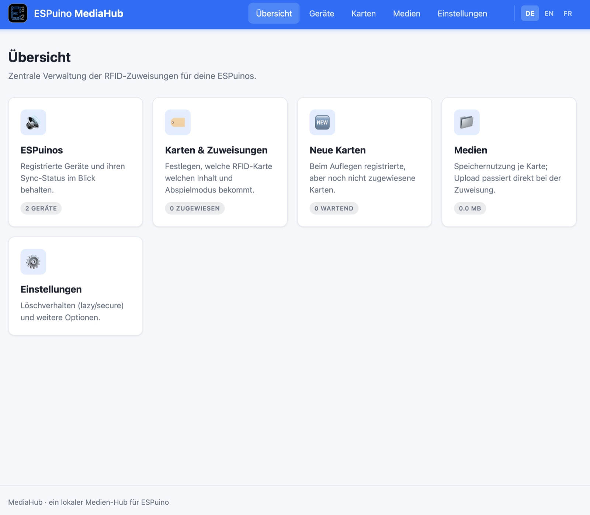
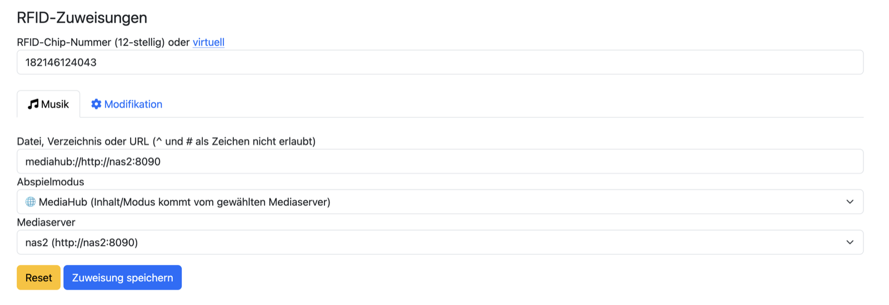
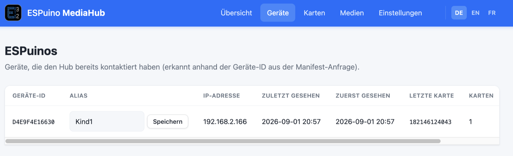
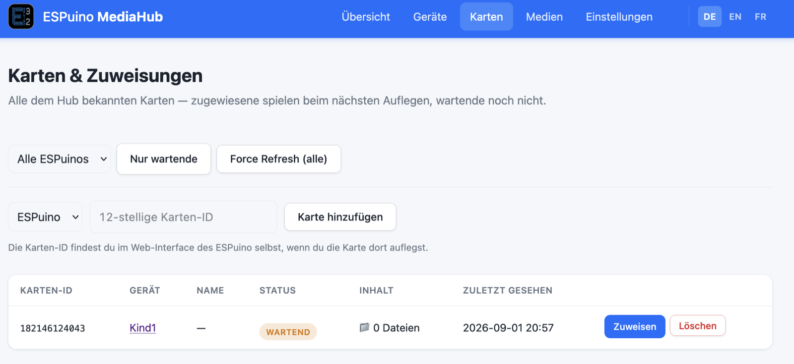
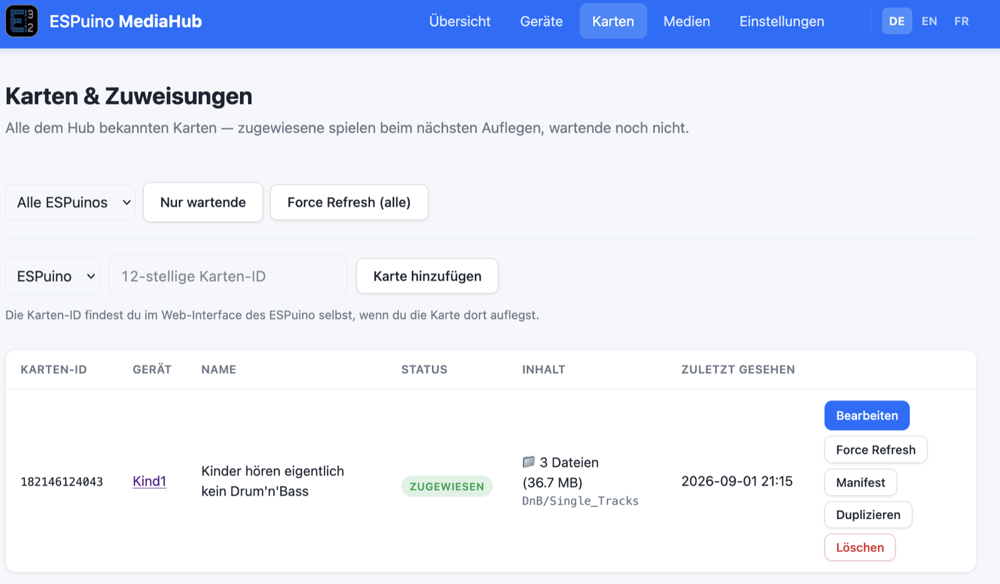
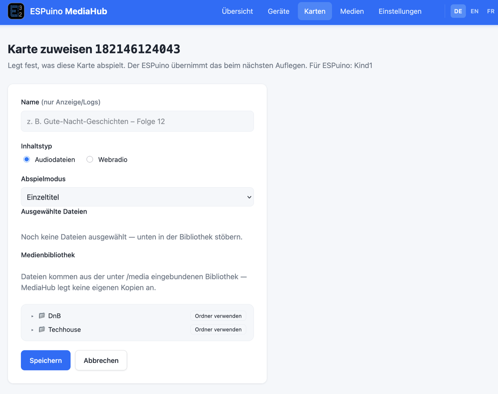
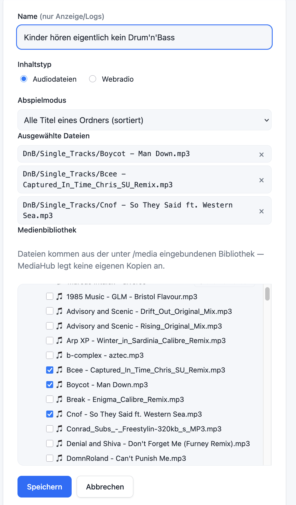
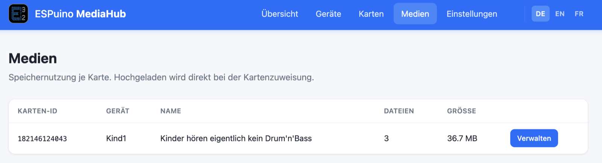
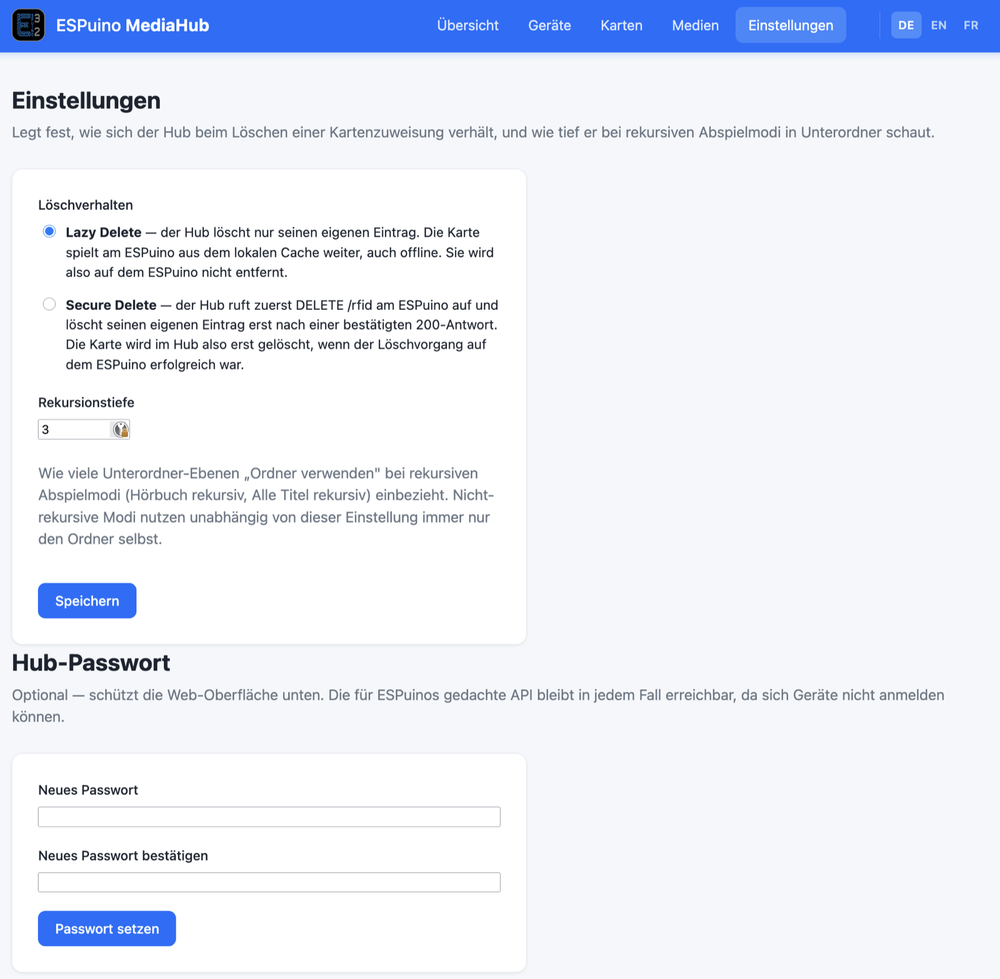

# 11 · Gérer plusieurs ESPuinos de façon centralisée : MediaHub


*La page d'aperçu de MediaHub : appareils, cartes et attributions, nouvelles cartes et médias en un
coup d'œil. L'interface est aussi disponible en anglais et en français (à basculer en haut à
droite) ; cette capture montre la version allemande.*

## Quel problème MediaHub résout

Tant que tu n'exploites qu'un seul ESPuino, tout est simple : tu configures tes attributions de
cartes dans l'interface web, et elles se trouvent dans la mémoire de cet unique appareil. Mais dès
que plusieurs ESPuinos se trouvent dans le foyer – un dans la chambre d'enfant, un dans le salon, un
pour la route –, la maintenance devient fastidieuse. Il faudrait apprendre chaque nouvelle carte
individuellement sur chaque appareil, et remplir chaque carte SD séparément.

C'est exactement ce problème que résout **MediaHub**. MediaHub est un composant additionnel
**optionnel** qui te permet de gérer les attributions de cartes **de façon centralisée** en un seul
endroit, au lieu de le faire séparément sur chaque appareil. Si tu n'as qu'un seul ESPuino, tu n'as
pas besoin de MediaHub – pour tous les autres cas, cela peut considérablement simplifier la gestion.
La fonction ne s'appelle volontairement pas « cloud » : MediaHub fonctionne **localement sur ton
propre réseau**, tes fichiers médias restent chez toi.

!!! info "Où trouver le guide complet"
    Ce chapitre couvre la configuration et l'utilisation en détail. Pour les détails du code source
    lui-même – par exemple si tu souhaites contribuer au développement de MediaHub – le
    [dépôt MediaHub](https://github.com/biologist79/ESPuino-Mediahub) reste la référence ; la
    discussion approfondie se déroule dans le
    [fil de discussion du forum #4607](https://forum.espuino.de/t/espuino-mediahub/4607) (en
    allemand).

## Comment ça fonctionne

MediaHub est un petit **service serveur auto-hébergé**, qui tourne sous forme de conteneur Docker
sur ton propre réseau (un Raspberry Pi suffit amplement). Il détient les attributions de cartes
centralisées et connaît tes fichiers médias – qui restent exactement là où ils se trouvent déjà dans
ta propre structure de dossiers ; MediaHub ne les copie ni ne les gère lui-même, il les monte
uniquement en **lecture seule**.

Le processus se compose de six étapes :

1. **Enregistrer le serveur MediaHub.** Dans l'interface web de l'ESPuino, saisis l'adresse de ton
   serveur MediaHub dans l'[onglet MediaHub](../bedienung/webinterface.md#tab-mediahub). Tu peux
   enregistrer plusieurs serveurs et les supprimer à nouveau sans que cela n'affecte les cartes déjà
   apprises.
2. **Apprendre une carte en mode « MediaHub ».** Dans l'[onglet RFID](../bedienung/webinterface.md#tab-rfid),
   apprends une nouvelle carte – comme mode de lecture, choisis **MediaHub**, puis en dessous, le
   serveur de médias souhaité dans la liste des serveurs enregistrés. Tu n'indiques pas de chemin
   ici ; l'ESPuino sait seulement quel serveur contacter.
3. **Première pose : enregistrement.** La première fois que tu poses la carte, l'ESPuino envoie une
   requête à MediaHub. La carte y apparaît alors comme « en attente » – avec l'ID de la carte et
   l'identifiant de l'ESPuino demandeur, mais sans contenu pour l'instant.
4. **Attribution sur MediaHub.** Dans l'interface web de MediaHub, tu associes la carte en attente à
   un contenu – un fichier, un dossier ou un flux de radio web – et définis le mode de lecture,
   exactement comme tu le ferais sinon dans l'interface web de l'ESPuino.
5. **Deuxième pose : téléchargement.** La prochaine fois que la carte est posée, l'ESPuino
   redemande et reçoit cette fois un **manifeste** – la liste de tous les fichiers nécessaires. Il
   les télécharge et les stocke dans un répertoire caché sur sa propre carte SD. La lecture est
   verrouillée pendant le téléchargement ; l'anneau Neopixel affiche la progression en bleu.
6. **Lecture.** Une fois le téléchargement terminé, la lecture démarre – désormais **localement
   depuis sa propre carte SD**, indépendamment de MediaHub. Si tu modifies l'attribution plus tard
   sur MediaHub, l'ESPuino ne le remarque pas automatiquement de lui-même à la pose suivante ; tu
   déclenches cela délibérément avec **« Force Refresh »** (plus de détails plus bas).

!!! note "Ce qui est centralisé – et ce qui ne l'est pas"
    MediaHub ne te dispense pas de **poser les cartes** : tu dois toujours poser chaque carte **une
    fois par appareil** et la faire pointer vers MediaHub à cet endroit (étape 2 ci-dessus). La
    raison : sinon, MediaHub lui-même aurait besoin de son propre lecteur RFID juste pour connaître
    l'ID de la carte. Ce qui est centralisé, c'est uniquement le **lien réel vers le contenu** –
    c'est-à-dire quels fichiers ou quel flux, et quel mode de lecture, correspondent à une carte. Tu
    maintiens cette association une seule fois sur MediaHub, et chaque appareil la récupère à partir
    de là.

## Configurer le serveur MediaHub

Pour le serveur, il te faut une machine avec **Docker** et le **plugin Compose** – un Raspberry Pi
suffit amplement.

```bash
git clone https://github.com/biologist79/ESPuino-Mediahub
cd ESPuino-Mediahub
cp env-example .env       # tes propres réglages vont dans .env
mkdir -p data
chown -R 33:33 data
docker compose up -d --build
```

L'astuce : tes réglages personnels se trouvent dans le fichier `.env`, pas dans les fichiers
fournis comme `docker-compose.yml`. Ne modifie que le `.env` – cela a une raison pratique : une mise
à jour ultérieure via `git pull` reste ainsi **sans conflit**.

### Le fichier `.env`

| Variable | Par défaut | Signification |
| --- | --- | --- |
| `MEDIAHUB_PORT` | `8080` | Port sur lequel MediaHub est accessible. Choisis-en un autre s'il est déjà utilisé. |
| `MEDIAHUB_DATA` | `./data` | Emplacement de stockage de la base de données MediaHub (`db.json`). Le dossier a besoin d'un accès en écriture. |
| `MEDIAHUB_MEDIA` | `./media` | Chemin vers ta collection de médias existante. Montée en **lecture seule** – MediaHub n'y crée ni n'y modifie jamais rien. |
| `MEDIAHUB_UID` / `MEDIAHUB_GID` | `33` / `33` | ID utilisateur/groupe avec lequel le conteneur s'exécute (par défaut : `www-data`). Si tu changes ces valeurs, adapte les commandes `chown` en conséquence. |
| `TZ` | `Europe/Berlin` | Fuseau horaire du conteneur, utilisé par exemple pour des horodatages comme « vu pour la dernière fois ». |

!!! tip "Fichiers visibles mais pas lisibles ?"
    Le listage d'un répertoire et la lecture d'un fichier sont deux droits Unix distincts : un titre
    peut apparaître dans l'arborescence des fichiers, mais échouer quand même avec « permission
    denied » lors de l'attribution, si le fichier lui-même n'est pas lisible par l'UID de MediaHub.
    Soit `chmod -R o+rX /chemin/vers/ta/bibliotheque` corrige cela, soit tu règles
    `MEDIAHUB_UID`/`MEDIAHUB_GID` dans `.env` sur l'UID/GID qui possède déjà ta bibliothèque
    (`id -u` / `id -g`).

Après le démarrage, vérifie avec `docker compose ps` si le conteneur fonctionne, et ouvre MediaHub
dans ton navigateur à l'adresse `http://<ton-ip>:8080`.

!!! warning "Le HTTPS n'est pas recommandé"
    Si tu as vraiment besoin de chiffrement, place un reverse proxy devant (Traefik, par exemple).
    Pour la connexion **entre l'ESPuino et MediaHub**, en revanche, le HTTPS est une mauvaise idée :
    cela coûte de la mémoire déjà limitée sur l'ESP32 et réduit sensiblement le débit – en clair, tu
    obtiens environ 650–700 Ko/s, chiffré nettement moins.

## Mettre à jour

```bash
git pull
docker compose up -d --build
```

`git pull` reste sans conflit car tes réglages se trouvent dans `.env` (ignoré par Git), pas dans
les fichiers suivis. Le dossier `data` – et donc toute ta configuration – reste intact. Après une
mise à jour, jette quand même un œil à `env-example` : les nouvelles options y apparaissent d'abord
et doivent être reprises manuellement dans ton propre `.env` si tu les souhaites. `--build` n'est
pas facultatif ici – sans lui, Compose continue d'utiliser l'image existante et redémarre simplement
l'ancienne version.

!!! note "Ne pas modifier docker-compose.yml directement"
    Des modifications personnelles de `docker-compose.yml` provoqueront des conflits à chaque
    `git pull`. Si tu as besoin d'extensions qui ne peuvent pas passer par `.env`, crée plutôt ton
    propre `docker-compose.override.yml`.

Selon ce qui a changé dans l'interaction avec l'ESPuino, une
[mise à jour du firmware](../firmware/aktualisieren.md) sur les appareils eux-mêmes peut aussi être
utile.

## Sauvegarde

Le conteneur Docker lui-même est un objet jetable – il peut être reconstruit à tout moment. Ce qui
compte, c'est uniquement le dossier `data` : sans son contenu (le fichier de base de données
`db.json`), toute la configuration de MediaHub, les ESPuinos enregistrés et les attributions de
cartes sont perdus. Sauvegarde donc ce dossier régulièrement, idéalement en dehors du serveur
lui-même.

!!! warning "Ne pas modifier la base de données à la main"
    Le fichier `db.json` ne devrait pas être édité manuellement. Si tu dois malgré tout y travailler
    directement, arrête d'abord le conteneur avec `docker compose stop`.

## MediaHub dans l'interface web de l'ESPuino

Sur l'ESPuino lui-même, MediaHub te concerne à deux endroits : l'
[onglet MediaHub](../bedienung/webinterface.md#tab-mediahub), pour enregistrer des serveurs, et l'
[onglet RFID](../bedienung/webinterface.md#tab-rfid), pour attribuer réellement une carte à un
serveur.



Lorsque tu choisis le mode de lecture **MediaHub** en apprenant une carte, un autre menu déroulant
apparaît en dessous : **serveur de médias**, listant tous les serveurs enregistrés. Le champ
« fichier, répertoire ou URL » se remplit alors automatiquement – comme une combinaison du préfixe
`mediahub://` et de l'adresse du serveur, par exemple `mediahub://http://nas2:8090`. Tu ne saisis
pas cela toi-même, c'est une comptabilité purement interne : ainsi, l'ESPuino sait quel serveur
contacter la prochaine fois que la carte est posée.

## L'interface web de MediaHub

L'interface web du serveur MediaHub lui-même est organisée en cinq sections : **ESPuinos**,
**cartes et attributions**, **nouvelles cartes** (un filtre sur les cartes pas encore attribuées),
**médias** et **réglages** – toutes accessibles via la navigation en haut.

### Appareils



MediaHub liste ici tous les ESPuinos qui l'ont déjà contacté – reconnus grâce à l'ID d'appareil
provenant de la requête de manifeste. Pour chaque appareil, tu vois son adresse IP, la date de
dernière et de première détection, quelle carte a été posée le plus récemment, et combien de cartes
sont déjà attribuées à cet appareil. Le nom d'affichage par défaut est l'ID technique de l'appareil ;
le champ de texte à côté te permet d'attribuer à la place un **alias**, comme « Enfant1 », qui
s'affiche ensuite partout ailleurs dans l'interface.

### Cartes et attributions



Cette page liste toutes les cartes connues de MediaHub – les cartes attribuées jouent à la
prochaine pose, celles en attente pas encore. Les filtres en haut te permettent de restreindre à un
appareil ESPuino précis, d'afficher les cartes non attribuées avec **« Uniquement en attente »**, ou
de déclencher un nouveau téléchargement pour toutes les cartes à la fois avec **« Force Refresh
(toutes) »**. Si tu connais déjà l'ID de carte à douze chiffres (disponible dans l'interface web de
l'ESPuino lui-même dès que tu y poses la carte), tu peux aussi ajouter une carte manuellement sans
la poser au préalable.



Une fois une carte attribuée, cinq actions sont disponibles par ligne :

| Action | Effet |
| --- | --- |
| **Modifier** | Change l'attribution après coup. Si les données ont déjà été transférées sur l'ESPuino, un « Force Refresh » est ensuite nécessaire pour que le changement arrive réellement. |
| **Force Refresh** | Force un nouveau téléchargement bien que l'ESPuino ait déjà chargé les données une fois – le moyen habituel de diffuser un changement. |
| **Manifeste** | Affiche le fichier de téléchargement que l'ESPuino reçoit pour cette carte. |
| **Dupliquer** | Copie l'attribution, pratique quand plusieurs ESPuinos doivent apprendre la même carte avec le même contenu. |
| **Supprimer** | Supprime l'attribution (attention au réglage de suppression, voir ci-dessous). |

#### Le formulaire d'attribution



Lors de l'attribution, tu remplis les champs suivants :

- **Nom** – pour ton propre repère uniquement, apparaît dans la liste et dans les journaux, mais n'a
  aucune fonction pour la lecture.
- **Type de contenu** – soit des **fichiers audio** de ta bibliothèque, soit un flux de **radio
  web** (MediaHub ne prend pas en charge une liste `.m3u` locale).
- **Mode de lecture** – la même liste que dans l'interface web de l'ESPuino (voir
  [chapitre 8 → modes de lecture](../bedienung/webinterface.md#abspielmodi)).
- **Bibliothèque de médias** – une arborescence de ta collection montée via `MEDIAHUB_MEDIA`.
  « Utiliser le dossier » adopte un dossier entier pour des modes comme « tous les titres d'un
  dossier ».

!!! tip "Aussi des fichiers individuels au lieu d'un dossier entier"
    Pour les modes basés sur un dossier comme « tous les titres d'un dossier (triés) », tu n'es pas
    obligé d'adopter le dossier entier : tu peux aussi **cocher des fichiers individuels** dans
    l'arborescence – seuls ceux-ci seront alors transférés, pas le reste du dossier. Pratique quand
    une carte ne doit couvrir qu'une sélection au sein d'une collection plus large.

    

### Médias



Cette page indique combien de fichiers et combien d'espace de stockage sont associés à chaque
carte. Il n'y a volontairement pas de zone d'upload dédiée – le téléversement ne se fait pas sur
cette page, mais directement lors de l'attribution de carte, en choisissant des fichiers dans ta
bibliothèque existante.

### Réglages



Tu définis ici comment MediaHub se comporte lors de la suppression d'une attribution de carte, et
jusqu'à quelle profondeur il explore les sous-dossiers pour les modes de lecture récursifs :

- **Comportement de suppression** – **Lazy Delete** (par défaut) ne supprime que l'entrée sur
  MediaHub ; la carte continue de jouer sans changement sur l'ESPuino depuis le cache local, même
  hors ligne, et n'y est pas supprimée. **Secure Delete**, en revanche, appelle d'abord la fonction
  de suppression sur l'ESPuino lui-même et ne supprime l'entrée sur MediaHub qu'une fois que
  l'appareil a confirmé la suppression – pour cela, l'ESPuino doit être joignable à ce moment-là.
- **Profondeur de récursion** (par défaut : 3) – définit combien de niveaux de sous-dossiers les
  modes de lecture récursifs comme « livre audio récursif » ou « tous les titres récursif »
  incluent lors du téléchargement. Les modes non récursifs n'utilisent toujours que le dossier
  choisi lui-même, indépendamment de ce réglage. Ne règle pas cette valeur inutilement haute –
  sinon une seule attribution peut entraîner involontairement beaucoup de données.
- **Mot de passe du hub** (optionnel) – protège uniquement l'**interface web** de MediaHub
  elle-même. L'API à laquelle s'adressent les ESPuinos reste accessible sans restriction, car les
  appareils ne peuvent pas se connecter.

## Pour aller plus loin

- [ESPuino-Mediahub sur GitHub](https://github.com/biologist79/ESPuino-Mediahub) – code source et
  spécification technique.
- [Fil de discussion du forum #4607](https://forum.espuino.de/t/espuino-mediahub/4607) – présentation
  et discussion (en allemand).
