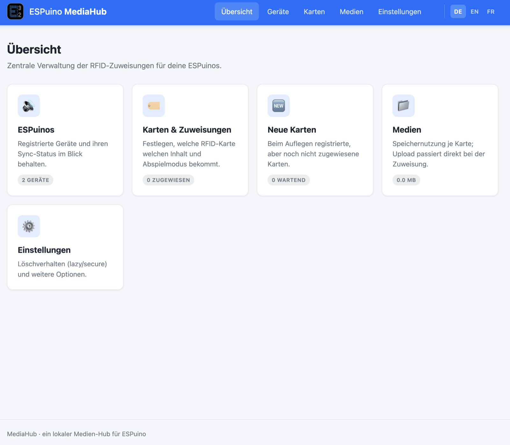
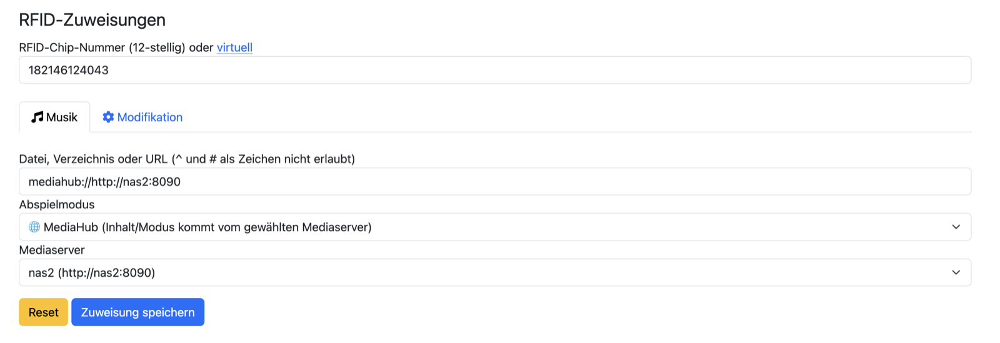
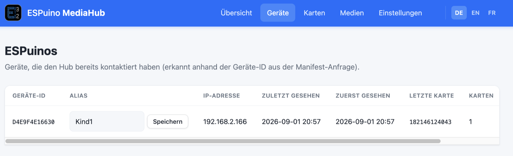
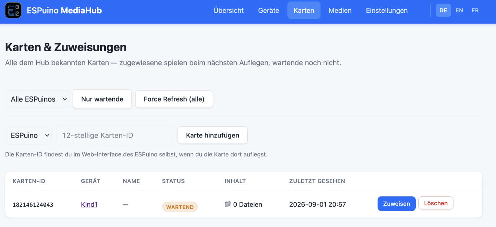
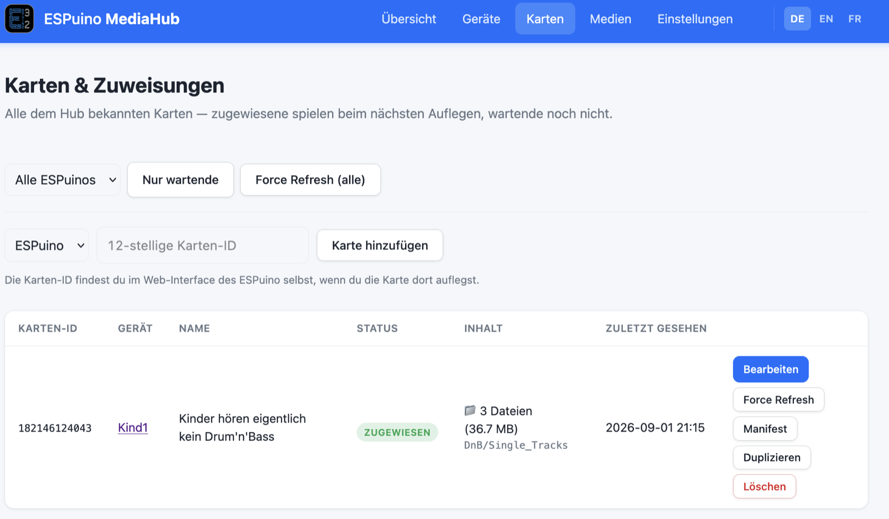
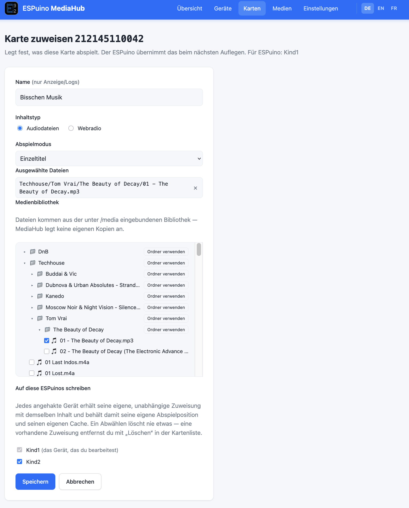
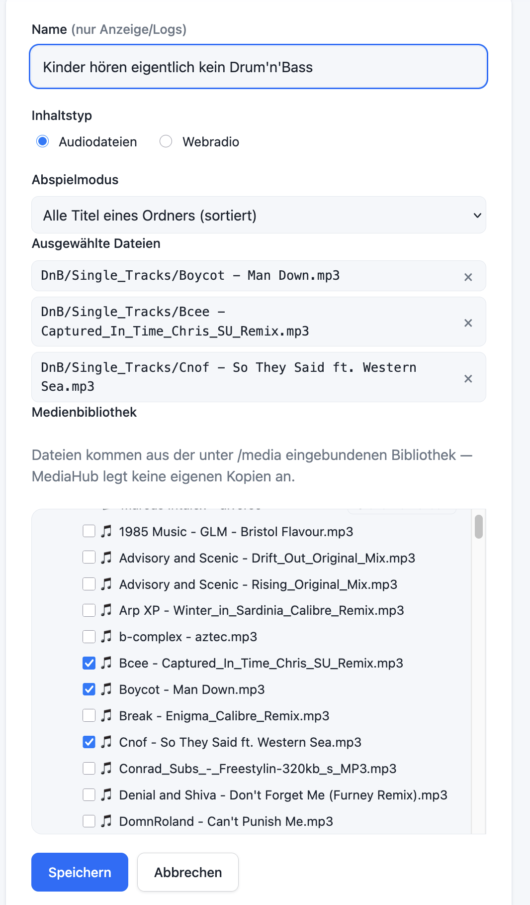
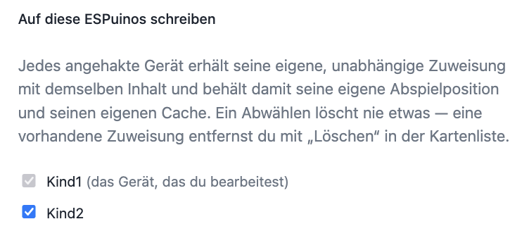
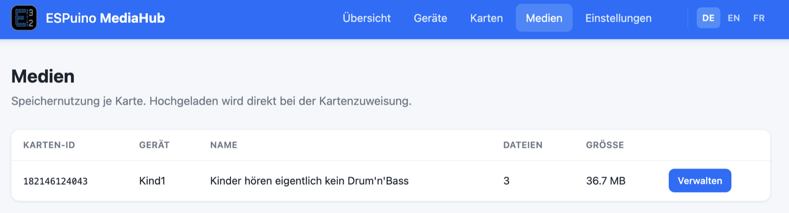
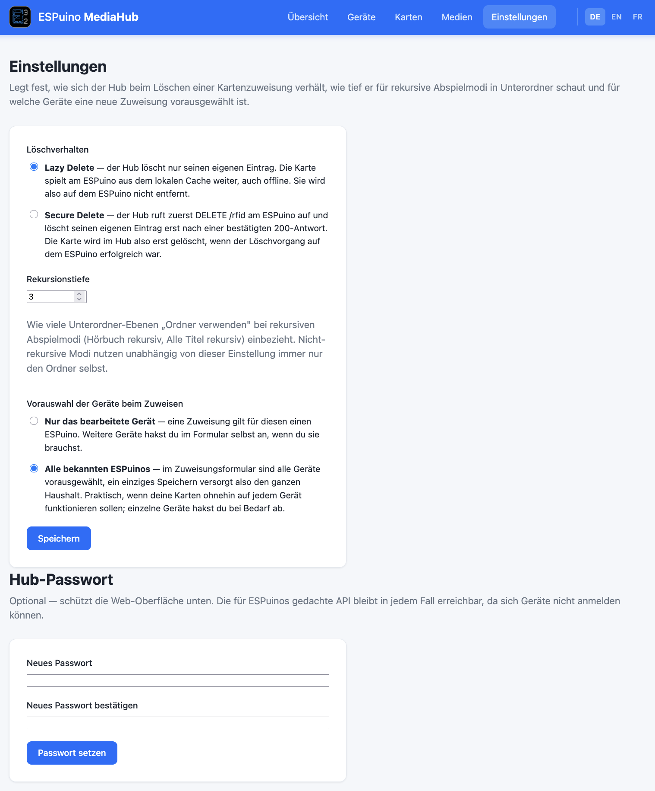

# 11 · Mehrere ESPuinos zentral verwalten: MediaHub


*Die MediaHub-Übersichtsseite: Geräte, Karten & Zuweisungen, neue Karten und Medien auf einen Blick.
Die Oberfläche gibt es auch auf Englisch und Französisch (oben rechts umschaltbar).*

## Welches Problem MediaHub löst

Solange du einen einzigen ESPuino betreibst, ist alles einfach: Du legst deine Kartenzuordnungen im
Webinterface an, und sie liegen im Speicher genau dieses Geräts. Sobald aber mehrere ESPuinos im
Haushalt stehen – im Kinderzimmer, im Wohnzimmer, eines für unterwegs –, wird die Pflege mühsam. Jede
neue Karte müsstest du auf jedem Gerät einzeln anlernen, und die SD-Karten getrennt bestücken.

Genau hier setzt **MediaHub** an. MediaHub ist eine **optionale** Zusatzkomponente, mit der du die
Kartenzuordnungen **zentral** an einer Stelle verwaltest, statt auf jedem Gerät für sich. Wer nur
einen ESPuino hat, für den bringt MediaHub vermutlich wenig Zugewinn. Wer hingegen mehrere
besitzt oder die Anschaffung eines weiteren plant, für den kann es die Verwaltung deutlich
entspannen. Bewusst heißt die Funktion nicht „Cloud": MediaHub läuft **lokal in deinem eigenen
Netzwerk**, deine Mediendateien bleiben bei dir zu Hause.

!!! info "Wo die vollständige Anleitung liegt"
    Dieses Kapitel deckt Einrichtung und Bedienung ausführlich ab. Für Details am Quellcode selbst –
    etwa wenn du an MediaHub mitentwickeln möchtest – bleibt das
    [MediaHub-Repository](https://github.com/biologist79/ESPuino-Mediahub) die Quelle; die
    ausführliche Forums-Diskussion läuft im
    [Forum-Thread #4607](https://forum.espuino.de/t/espuino-mediahub/4607).

## Wie es funktioniert

MediaHub ist ein kleiner, **selbst gehosteter Serverdienst**, der als Docker-Container in deinem
eigenen Netzwerk läuft (ein Raspberry Pi reicht dafür völlig). Er hält die zentralen
Kartenzuordnungen und kennt deine Mediendateien – die liegen unverändert in deiner eigenen
Ordnerstruktur, MediaHub kopiert oder verwaltet sie nicht selbst, sondern bindet sie nur **lesend**
ein.

Der Ablauf besteht aus sechs Schritten:

1. **MediaHub-Server registrieren.** Im ESPuino-Webinterface trägst du im
   [Tab MediaHub](../bedienung/webinterface.md#tab-mediahub) die Adresse deines MediaHub-Servers
   ein. Du kannst mehrere Server registrieren und auch wieder entfernen, ohne dass sich das auf
   bereits angelernte Karten auswirkt.
2. **Karte als „MediaHub" anlernen.** Im [Tab RFID](../bedienung/webinterface.md#tab-rfid) lernst du
   eine neue Karte an – als Abspielmodus wählst du **MediaHub** und darunter den gewünschten
   Mediaserver aus der Liste der registrierten Server. Einen Pfad gibst du dabei nicht an; ESPuino
   weiß nur, an welchen Server er sich wenden soll. Diesen Schritt kannst du dir sparen, wenn du die
   Option
   [„Unbekannte Karten ohne Anlernen direkt beim MediaHub nachfragen"](../bedienung/webinterface.md#mediahub-optionen)
   aktiviert hast – dann genügt das Auflegen selbst.
3. **Erstes Auflegen: Registrierung.** Legst du die Karte zum ersten Mal auf, schickt ESPuino eine
   Anfrage an den MediaHub. Dort taucht die Karte jetzt als „wartend" auf – mit der Karten-ID und
   der Kennung des anfragenden ESPuino, aber noch ohne Inhalt.
4. **Zuweisung am MediaHub.** Im MediaHub-Webinterface verknüpfst du die wartende Karte mit einem
   Inhalt – einer Datei, einem Ordner oder einem Webradio-Stream – und legst den Abspielmodus fest,
   genauso wie du es sonst im ESPuino-Webinterface tätest. Hast du mehrere Geräte, kannst du sie im
   selben Schritt gleich mitversorgen (siehe unten).
5. **Zweites Auflegen: Download.** Beim nächsten Auflegen fragt der ESPuino erneut an und bekommt
   diesmal ein **Manifest** zurück – die Liste aller benötigten Dateien. Er lädt sie herunter und
   legt sie in einem versteckten Verzeichnis auf der eigenen SD-Karte ab. Während des Downloads ist
   die Wiedergabe gesperrt; der Neopixel-Ring zeigt den Fortschritt in Blau.
6. **Wiedergabe.** Sobald der Download fertig ist, startet die Wiedergabe – von da an **lokal von
   der eigenen SD-Karte**, unabhängig vom MediaHub. Änderst du die Zuweisung später am MediaHub,
   bemerkt der ESPuino das von selbst: Beim nächsten Auflegen spielt er noch die alte Fassung,
   vergleicht dabei aber im Hintergrund die Version und merkt sich, dass eine neuere bereitliegt.
   Das übernächste Auflegen lädt sie herunter und spielt noch nicht; erst das darauffolgende spielt
   den neuen Inhalt.

!!! note "Was zentral ist – und was nicht"
    MediaHub nimmt dir das **Auflegen der Karten nicht** ab: Jede Karte musst du weiterhin **einmal
    pro Gerät** auflegen – entweder, um sie dabei wie in Schritt 2 auf MediaHub zu verweisen, oder,
    wenn du die Option
    [„Unbekannte Karten ohne Anlernen direkt beim MediaHub nachfragen"](../bedienung/webinterface.md#mediahub-optionen)
    aktiviert hast, allein durch das Auflegen selbst. Der Grund: Sonst bräuchte
    MediaHub selbst einen eigenen RFID-Reader, um die ID der Karte überhaupt zu kennen. Zentral ist
    nur die **eigentliche Verknüpfung zum Inhalt** – also welche Dateien bzw. welcher Stream und
    welcher Abspielmodus zu einer Karte gehören. Diese Zuordnung pflegst du einmal am MediaHub, und
    alle Geräte ziehen sie von dort.

## MediaHub-Server installieren

Für den Server brauchst du einen Rechner mit **Docker** und dem **Compose-Plugin** – ein Raspberry
Pi reicht völlig.

```bash
git clone https://github.com/biologist79/ESPuino-Mediahub
cd ESPuino-Mediahub
cp env-example .env       # eigene Einstellungen kommen in die .env
mkdir -p data
chown -R 33:33 data
docker compose up -d --build
```

Der Kniff dabei: Deine persönlichen Einstellungen liegen in der Datei `.env`, nicht in den
mitgelieferten Dateien wie `docker-compose.yml`. Bearbeite ausschließlich die `.env` – das hat einen
praktischen Grund: Ein späteres Update per `git pull` bleibt dadurch **konfliktfrei**.

### Die `.env`-Datei

| Variable | Standard | Bedeutung |
| --- | --- | --- |
| `MEDIAHUB_PORT` | `8080` | Port, unter dem MediaHub erreichbar ist. Ist er belegt, wähle einen anderen. |
| `MEDIAHUB_DATA` | `./data` | Ablageort der MediaHub-Datenbank (`db.json`). Der Ordner braucht Schreibzugriff. |
| `MEDIAHUB_MEDIA` | `./media` | Pfad zu deiner bestehenden Mediensammlung. Wird **read-only** eingebunden – MediaHub legt darin nichts an und verändert nichts. |
| `MEDIAHUB_UID` / `MEDIAHUB_GID` | `33` / `33` | Nutzer- bzw. Gruppen-ID, unter der der Container läuft (Standard: `www-data`). Änderst du diese Werte, musst du auch die `chown`-Befehle entsprechend anpassen. |
| `TZ` | `Europe/Berlin` | Zeitzone des Containers, etwa für Zeitstempel wie „zuletzt gesehen". |

!!! tip "Dateien sichtbar, aber nicht lesbar?"
    Verzeichnis-Auflistung und Datei-Lesen sind zwei getrennte Unix-Rechte: Ein Titel kann im
    Datei-Baum auftauchen, sich beim Zuweisen aber trotzdem mit „permission denied" weigern, wenn
    die Datei selbst für die MediaHub-UID nicht lesbar ist. Abhilfe schafft entweder
    `chmod -R o+rX /pfad/zu/deiner/bibliothek`, oder du setzt `MEDIAHUB_UID`/`MEDIAHUB_GID` in der
    `.env` auf die UID/GID, der deine Bibliothek ohnehin schon gehört (`id -u` / `id -g`).

Nach dem Start prüfst du mit `docker compose ps`, ob der Container läuft, und rufst MediaHub im
Browser unter `http://<deine-IP>:8080` auf.

!!! warning "HTTPS wird nicht empfohlen"
    Brauchst du unbedingt Verschlüsselung, schalte einen Reverse Proxy davor (etwa Traefik). Für die
    Verbindung **zwischen ESPuino und MediaHub** ist HTTPS dagegen keine gute Idee: Es kostet den
    ohnehin knappen Arbeitsspeicher des ESP32 und senkt den Datendurchsatz spürbar – unverschlüsselt
    sind etwa 650–700 kB/s drin, verschlüsselt deutlich weniger.

## Aktualisieren

```bash
git pull
docker compose up -d --build
```

`git pull` bleibt konfliktfrei, weil deine Einstellungen in der (von Git ignorierten) `.env` liegen
und nicht in den versionierten Dateien. Der Ordner `data` – und damit alle deine Konfigurationen –
bleibt dabei unangetastet. Wirf nach einem Update trotzdem einen Blick in `env-example`: Neue
Optionen tauchen dort zuerst auf und müssen bei Bedarf manuell in deine `.env` übernommen werden.
`--build` ist dabei kein Selbstzweck – ohne diesen Parameter verwendet Compose das vorhandene Image
weiter und startet einfach wieder die alte Version.

!!! note "docker-compose.yml nicht direkt ändern"
    Eigene Anpassungen an `docker-compose.yml` führen bei jedem `git pull` zu Konflikten. Brauchst
    du Erweiterungen, die sich nicht über die `.env` abbilden lassen, leg dir stattdessen eine
    eigene `docker-compose.override.yml` an.

Je nachdem, was sich an der Zusammenarbeit mit ESPuino geändert hat, kann zusätzlich ein
[Firmware-Update](../firmware/aktualisieren.md) auf den Geräten selbst sinnvoll sein.

## Datensicherung

Der Docker-Container selbst ist ein Wegwerfobjekt – er lässt sich jederzeit neu bauen. Was zählt,
ist allein der Ordner `data`: Ohne dessen Inhalt (die Datenbank-Datei `db.json`) sind alle
MediaHub-Konfigurationen, registrierten ESPuinos und Kartenzuweisungen verloren. Sichere diesen
Ordner deshalb regelmäßig, am besten außerhalb des Servers.

!!! warning "Datenbank nicht von Hand bearbeiten"
    Die `db.json` sollte nicht manuell editiert werden. Musst du dennoch einmal direkt daran
    arbeiten, stoppe vorher den Container mit `docker compose stop`.

## MediaHub im ESPuino-Webinterface

Am ESPuino selbst betrifft dich MediaHub an zwei Stellen: der [Tab
MediaHub](../bedienung/webinterface.md#tab-mediahub), um Server zu registrieren, und der [Tab
RFID](../bedienung/webinterface.md#tab-rfid), um eine Karte tatsächlich einem Server zuzuweisen.
Welche Karten dieses Geräts bereits auf einen Mediaserver zeigen und wie aktuell ihre lokale Kopie
ist, verrät dir die
[Liste der gespeicherten Zuweisungen](../bedienung/webinterface.md#zuweisungsliste) im Tab Tools.



Wählst du beim Anlernen einer Karte den Abspielmodus **MediaHub**, erscheint darunter ein weiteres
Dropdown **Mediaserver** mit allen registrierten Servern. Das Feld „Datei, Verzeichnis oder URL"
füllt sich dabei automatisch – als Kombination aus dem Präfix `mediahub://` und der Server-Adresse,
etwa `mediahub://http://nas2:8090`. Das trägst du nicht selbst ein, es ist reine interne
Buchführung: So weiß ESPuino beim nächsten Auflegen, an welchen Server er sich wenden muss.

!!! tip "Das Anlernen kannst du dir auch sparen"
    Aktivierst du im Tab MediaHub die Option
    [„Unbekannte Karten ohne Anlernen direkt beim MediaHub nachfragen"](../bedienung/webinterface.md#mediahub-optionen),
    entfällt dieser Schritt ganz: Legst du eine Karte auf, die der ESPuino nicht kennt, fragt er
    von sich aus bei den registrierten Servern nach und übernimmt eine dort hinterlegte Zuweisung
    automatisch. Das lohnt sich vor allem bei mehreren Geräten – sonst müsstest du jede Karte auf
    jedem Gerät einzeln anlernen.

## Das MediaHub-Webinterface

Die Weboberfläche des MediaHub-Servers selbst gliedert sich in fünf Bereiche: **ESPuinos**, **Karten
& Zuweisungen**, **Neue Karten** (ein Filter auf noch unzugewiesene Karten), **Medien** und
**Einstellungen** – alle über die Navigation oben erreichbar.

### Geräte



Hier listet MediaHub alle ESPuinos, die sich bereits gemeldet haben – erkannt anhand der Geräte-ID
aus der Manifest-Anfrage. Zu jedem Gerät siehst du die IP-Adresse, wann es zuletzt und zuerst
gesehen wurde, welche Karte zuletzt aufgelegt wurde und wie viele Karten diesem Gerät bereits
zugeordnet sind. Der voreingestellte Anzeigename ist die technische Geräte-ID; über das Textfeld
daneben vergibst du stattdessen einen **Alias** wie „Kind1", der dir überall sonst in der Oberfläche
angezeigt wird.

### Karten & Zuweisungen



Diese Seite listet alle Karten, die dem MediaHub bekannt sind – zugewiesene spielen beim nächsten
Auflegen, wartende noch nicht. Über die Filter oben schränkst du auf ein bestimmtes ESPuino-Gerät
ein, blendest mit **„Nur wartende"** unzugewiesene Karten ein, oder stößt mit **„Force Refresh
(alle)"** für sämtliche Karten einen erneuten Download an. Kennst du die zwölfstellige Karten-ID
bereits (zu finden im ESPuino-Webinterface selbst, sobald du die Karte dort auflegst), kannst du
eine Karte auch ganz ohne vorheriges Auflegen manuell hinzufügen.

Wartende Karten entstehen übrigens auch dann, wenn ein ESPuino mit der oben genannten Option nach
einer ihm unbekannten Karte fragt und kein Server sie kennt. Das Auflegen einer neuen Karte meldet
sie also hier an, noch bevor sie irgendwo zugewiesen ist.

Die Liste hält sich dabei selbst aktuell: Legst du eine Karte auf, während diese Seite offen ist,
erscheint sie nach wenigen Sekunden von allein – neu laden musst du nichts. Tippst du in diesem
Moment gerade eine Karten-ID ein oder hast ein Dialogfenster offen, wird dir die Seite nicht unter
den Händen weggezogen; stattdessen erscheint oben ein Streifen mit dem Knopf **„Jetzt
aktualisieren"**.



Ist eine Karte zugewiesen, stehen dir pro Zeile fünf Aktionen zur Verfügung:

| Aktion | Wirkung |
| --- | --- |
| **Bearbeiten** | Ändert die Zuweisung nachträglich. Wurden die Daten bereits auf den ESPuino übertragen, holt er sich die neue Fassung von selbst – wie in Schritt 6 oben beschrieben, über die nächsten Auflegevorgänge. |
| **Force Refresh** | Erzwingt einen erneuten Download, obwohl sich am Inhalt nichts geändert hat – gedacht für den Fall, dass die lokale Kopie auf dem ESPuino beschädigt ist oder fehlt. |
| **Manifest** | Zeigt die Download-Datei, die der ESPuino für diese Karte bekommt. |
| **Duplizieren** | Kopiert eine fertige Zuweisung nachträglich auf ein weiteres Gerät – etwa, wenn ein ESPuino erst später dazukommt. Beim Anlegen und Bearbeiten gehst du stattdessen direkt über die Geräte-Häkchen im Formular (siehe unten). |
| **Löschen** | Entfernt die Zuordnung (beachte dabei die Lösch-Einstellung, siehe unten). |

!!! warning "Datei ausgetauscht? Zuweisung neu speichern"
    Ersetzt du eine Datei in deiner Bibliothek durch eine neue Fassung, ohne die Zuweisung im
    Formular erneut zu speichern, hilft auch ein „Force Refresh" nicht weiter: Der ESPuino prüft
    jede geladene Datei gegen Größe und Prüfsumme aus dem Manifest, und die kennt MediaHub noch vom
    alten Stand. Der Download scheitert an dieser Prüfung, und es bleibt bei der alten Kopie. Öffne
    in so einem Fall die Zuweisung einmal und speichere sie erneut – dabei liest MediaHub Größe und
    Prüfsumme frisch ein, und der ESPuino holt sich die neue Fassung von allein.

#### Das Zuweisungs-Formular



Beim Zuweisen füllst du folgende Felder aus:

- **Name** – nur zur eigenen Orientierung, taucht in der Liste und in Logs auf, hat aber keine
  Funktion für die Wiedergabe.
- **Inhaltstyp** – entweder **Audiodateien** aus deiner Bibliothek oder ein **Webradio**-Stream
  (eine lokale `.m3u`-Liste unterstützt MediaHub nicht).
- **Abspielmodus** – dieselbe Liste wie im ESPuino-Webinterface (siehe
  [Kapitel 8 → Die Abspielmodi](../bedienung/webinterface.md#abspielmodi)).
- **Medienbibliothek** – ein Ordnerbaum deiner unter `MEDIAHUB_MEDIA` eingebundenen Sammlung. Über
  „Ordner verwenden" übernimmst du einen ganzen Ordner für Modi wie „Alle Titel eines Ordners".
- **Auf diese ESPuinos schreiben** – alle übrigen bekannten Geräte als Häkchen. Jedes angehakte
  Gerät erhält dieselbe Zuweisung, so dass eine Karte mit einem einzigen Speichern auf mehreren
  ESPuinos landet. Der Block erscheint nur, wenn überhaupt ein zweites Gerät bekannt ist.

!!! tip "Auch einzelne Dateien statt eines ganzen Ordners"
    Bei ordnerbasierten Modi wie „Alle Titel eines Ordners (sortiert)" musst du nicht zwingend den
    kompletten Ordner übernehmen: Du kannst im Baum auch **einzelne Dateien anhaken** – nur diese
    werden dann übertragen, nicht der Rest des Ordners. Praktisch, wenn eine Karte nur eine Auswahl
    aus einer größeren Sammlung abdecken soll.



!!! note "Mehrere Geräte, mehrere Einträge"
    Jedes angehakte Gerät bekommt eine **eigene** Zuweisung mit demselben Inhalt, keinen gemeinsamen
    Eintrag für alle. Das ist Absicht: So behält jeder ESPuino bei Hörbüchern seine eigene
    Abspielposition und seinen eigenen Download-Cache. Trägt ein Gerät die Karte schon, ist sein
    Häkchen von vornherein gesetzt – damit eine nachträgliche Änderung am Inhalt nicht nur auf einem
    Gerät ankommt und die Einträge auseinanderlaufen. Das Gerät, dessen Karte du gerade bearbeitest,
    ist immer angehakt und lässt sich nicht abwählen.

    **Ein Abwählen löscht nichts.** Ein leeres Häkchen heißt „dieses Gerät nicht anfassen", nicht
    „Zuweisung dort entfernen" – zum Löschen nimmst du **„Löschen"** in der Kartenliste. Der Grund:
    Löschen kann je nach Einstellung den ESPuino selbst kontaktieren, und das soll nicht als
    Nebenwirkung eines Speichern-Knopfs passieren.



### Medien



Diese Seite zeigt, wie viele Dateien und wie viel Speicherplatz zu jeder Karte gehören. Einen
eigenen Upload-Bereich gibt es bewusst nicht – hochgeladen wird nicht auf dieser Seite, sondern
direkt bei der Kartenzuweisung, indem du Dateien aus deiner bestehenden Bibliothek auswählst.

### Einstellungen



Hier legst du fest, wie sich MediaHub beim Löschen einer Kartenzuweisung verhält, wie tief er bei
rekursiven Abspielmodi in Unterordner schaut und für welche Geräte eine neue Zuweisung vorausgewählt
ist:

- **Löschverhalten** – **Lazy Delete** (Standard) löscht nur den Eintrag im MediaHub; die Karte
  spielt am ESPuino unverändert aus dem lokalen Cache weiter, auch offline, und wird dort nicht
  entfernt. **Secure Delete** ruft dagegen zuerst die Lösch-Funktion am ESPuino selbst auf und
  entfernt den Eintrag im MediaHub erst, nachdem das Gerät den Löschvorgang bestätigt hat – dafür
  muss der ESPuino zu diesem Zeitpunkt erreichbar sein.
- **Rekursionstiefe** (Standard: 3) – legt fest, wie viele Unterordner-Ebenen rekursive Abspielmodi
  wie „Hörbuch rekursiv" oder „Alle Titel rekursiv" beim Download einbeziehen. Nicht-rekursive Modi
  nutzen unabhängig davon immer nur den gewählten Ordner selbst. Setze den Wert nicht unnötig hoch –
  sonst kann eine einzelne Zuweisung ungewollt viele Daten nach sich ziehen.
- **Vorauswahl der Geräte beim Zuweisen** – bestimmt nur, welche Häkchen das Zuweisungs-Formular
  von vornherein mitbringt. **Nur das bearbeitete Gerät** (Standard) verhält sich wie bisher; **Alle
  bekannten ESPuinos** hakt jedes Gerät gleich an, so dass ein einziges Speichern den ganzen
  Haushalt versorgt. Geschrieben wird in beiden Fällen nur, was beim Speichern tatsächlich angehakt
  ist.
- **Hub-Passwort** (optional) – schützt nur die **Weboberfläche** von MediaHub selbst. Die
  API-Schnittstelle, über die sich die ESPuinos melden, bleibt davon unberührt erreichbar, da Geräte
  sich nicht anmelden können.

## Weiterführend

- [ESPuino-Mediahub auf GitHub](https://github.com/biologist79/ESPuino-Mediahub) – Quellcode und
  technische Spezifikation.
- [Forum-Thread #4607](https://forum.espuino.de/t/espuino-mediahub/4607) – Vorstellung und
  Diskussion.
