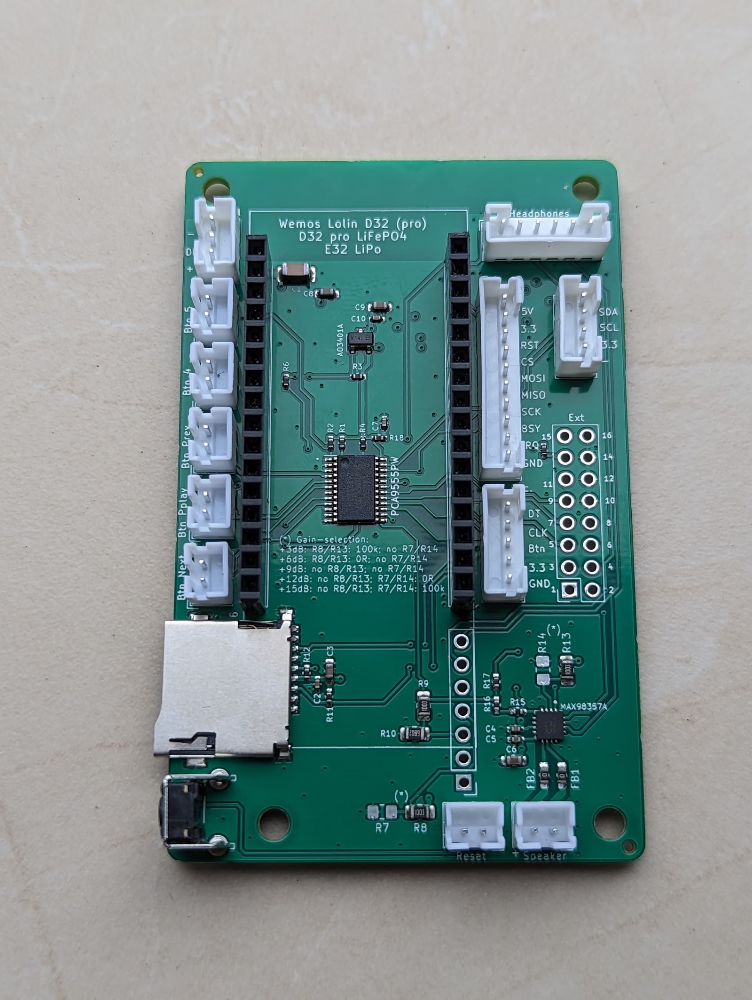

# 16 · Existing devices: mini4L

The **mini4L** is the direct predecessor of the [Complete](../hardware/complete.md). It's no
longer sold, but remains fully supported – so if you own one, you're in the right place. So this
handbook doesn't explain everything twice, this chapter deliberately limits itself to the
**differences** from the Complete. Everything not mentioned here – and that's by far the largest
part, from operation to the web interface – works on the mini4L exactly as described in the other
chapters.

## What sets the mini4L apart

Unlike the Complete, which combines everything on one board, the mini4L consists of two parts: a
carrier board and a **plugged-in developer board** on top of it (a purpose-built D32 Pro board, see
[forum #1109](https://forum.espuino.de/t/esp32-develboard-d32-pro-lifepo4/1109), German-language).
The firmware build target is accordingly called **`lolin_d32_pro_sdmmc_pe`**. It's introduced and
discussed in [forum #1661](https://forum.espuino.de/t/espuino-mini-4layer/1661) (German-language).

## Pinout and SD-MMC

In practice, the actual ESP32 GPIOs are **largely identical to the Complete**: I²S on 25/27/26, the
RFID SPI lines on 21/18/23/19, RFID_BUSY on 33 and RST on 22, the encoder on CLK 34 / DT 39, the LED
on 12, wakeup and port-expander interrupt on 36, battery measurement on 35, and the IR receiver on
5. The SD card runs in **SD-MMC mode (1-bit)** via CLK 14, CMD 15, and D0 2. The Next, Prev, and
Play/Pause buttons also sit on port-expander channels 102, 100, and 101, just as on the Complete.

The differences are limited to a few **port-expander channels**:

| Signal | mini4L | Complete |
| --- | --- | --- |
| Amplifier enable (`GPIO_PA_EN`) | PE 108 | PE 113 |
| Encoder button | PE 103 | PE 105 |
| Button 4 / 5 | PE 104 / 105 | PE 103 / 104 |
| Headphone detection (`HP_DETECT`) | PE 107 | PE 108 |
| Power (peripheral cutoff) | PE 115 | PE 114 |

On the mini4L, the PN5180 IRQ is disabled by default (value `99`); for LPCD, you'd set it to
GPIO 32.

## Firmware and operation

You build the firmware with the `lolin_d32_pro_sdmmc_pe` target – otherwise
[chapter 13](../firmware/aktualisieren.md) applies unchanged. In everyday use, the most important
difference ultimately comes down to a hardware detail: on the mini4L, power supply runs through a
linear regulator (LDO) instead of the Complete's buck/boost regulator. What that means is explained
in detail in
[chapter 3 → power supply](../hardware/complete.md#die-stromversorgung-und-warum-sie-so-wichtig-ist).
**Operation and the web interface are fully identical** to the Complete.
